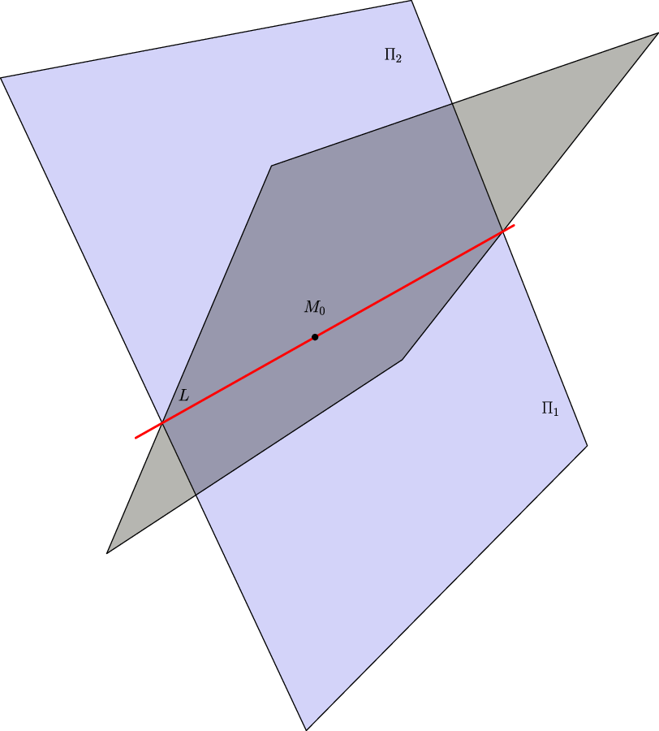
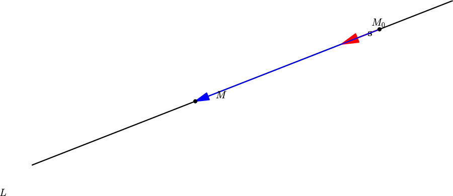
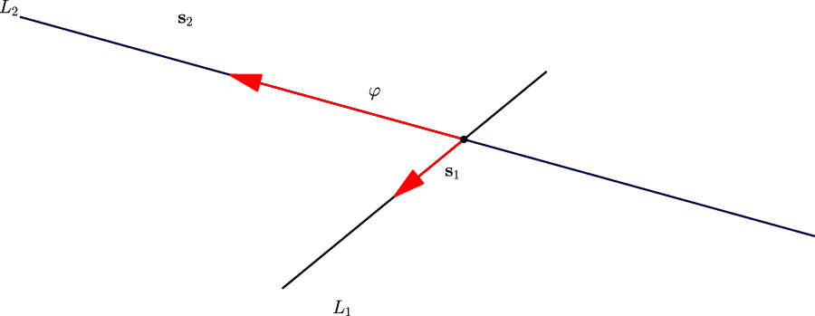
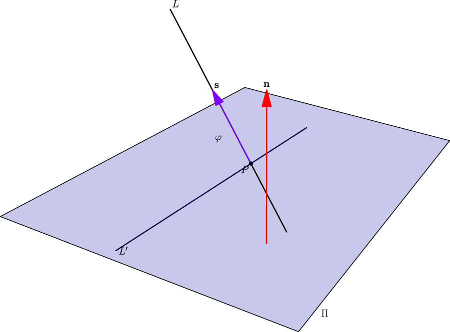

## 5. 空间直线及其方程

### 与上一小节的关系

平面用法向量表达。直线可以用两种方式表达：作为两个平面的交线，或用“点 + 方向向量”确定。

### 学习目标

- 会写空间直线的一般方程、对称式方程和参数方程。
- 会从两平面交线中找直线方向向量。
- 会求两直线夹角、直线与平面夹角。
- 会处理直线与平面的交点、投影直线等典型题。

### 正文内容

#### 5.1 直线的一般方程：两个平面的交线

若直线 $L$ 是两个相交平面的交线：

$$
\Pi_1:A_1x+B_1y+C_1z+D_1=0,
$$

$$
\Pi_2:A_2x+B_2y+C_2z+D_2=0,
$$

则直线可表示为

$$
\begin{cases}
A_1x+B_1y+C_1z+D_1=0,\\
A_2x+B_2y+C_2z+D_2=0.
\end{cases}
$$

这叫空间直线的一般方程。

大白话说：一个点在这条直线上，就是它同时在两个平面上。

#### 5.2 点向式、对称式和参数方程

平行于直线的非零向量叫方向向量。已知直线过点

$$
M_0(x_0,y_0,z_0)
$$

且方向向量为

$$
\mathbf s=(m,n,p),
$$

设 $M(x,y,z)$ 在直线上，则

$$
\overrightarrow{M_0M}//\mathbf s.
$$

所以

$$
\frac{x-x_0}{m}=\frac{y-y_0}{n}=\frac{z-z_0}{p}.
$$

这叫对称式方程或点向式方程。若令公共比为 $t$，得到参数方程：

$$
\begin{cases}
x=x_0+mt,\\
y=y_0+nt,\\
z=z_0+pt.
\end{cases}
$$

如果 $m,n,p$ 中有 $0$，不能直接写成除以 $0$。例如 $m=0$ 时，应写作

$$
\begin{cases}
x=x_0,\\
\dfrac{y-y_0}{n}=\dfrac{z-z_0}{p}.
\end{cases}
$$

从一般方程转成对称式的标准步骤：

1. 找直线上一点。可给某个变量取方便值，再解二元方程组。
2. 找方向向量。若两个平面法向量为 $\mathbf n_1,\mathbf n_2$，则交线方向向量可取

$$
\mathbf s=\mathbf n_1\times\mathbf n_2.
$$

例题：直线

$$
\begin{cases}
x+y+z+1=0,\\
2x-y+3z+4=0
\end{cases}
$$

取 $x=1$，得 $y=0,z=-2$，所以一点为 $(1,0,-2)$。两平面法向量为

$$
\mathbf n_1=(1,1,1),\qquad \mathbf n_2=(2,-1,3).
$$

方向向量

$$
\mathbf s=\mathbf n_1\times\mathbf n_2=(4,-1,-3).
$$

所以对称式为

$$
\frac{x-1}{4}=\frac{y}{-1}=\frac{z+2}{-3},
$$

参数式为

$$
\begin{cases}
x=1+4t,\\
y=-t,\\
z=-2-3t.
\end{cases}
$$

#### 5.3 两直线夹角

两直线夹角定义为方向向量夹角中的锐角或直角。若方向向量为

$$
\mathbf s_1=(m_1,n_1,p_1),\qquad
\mathbf s_2=(m_2,n_2,p_2),
$$

则夹角 $\varphi$ 满足

$$
\cos\varphi=
\frac{|m_1m_2+n_1n_2+p_1p_2|}
{\sqrt{m_1^2+n_1^2+p_1^2}\sqrt{m_2^2+n_2^2+p_2^2}}.
$$

垂直条件：

$$
m_1m_2+n_1n_2+p_1p_2=0.
$$

平行或重合条件：两个方向向量成比例。

例题：若

$$
L_1:\frac{x-1}{1}=\frac{y}{-4}=\frac{z+3}{1},
$$

$$
L_2:\frac{x}{2}=\frac{y+2}{-2}=\frac{z}{-1},
$$

方向向量为

$$
\mathbf s_1=(1,-4,1),\qquad \mathbf s_2=(2,-2,-1).
$$

代入公式得

$$
\cos\varphi=\frac{1}{\sqrt2},
$$

所以

$$
\varphi=\frac{\pi}{4}.
$$

#### 5.4 直线与平面的夹角

直线与平面的夹角，是直线和它在平面上的投影直线的夹角。设直线方向向量为

$$
\mathbf s=(m,n,p),
$$

平面法向量为

$$
\mathbf n=(A,B,C).
$$

若夹角为 $\varphi$，则

$$
\sin\varphi=
\frac{|Am+Bn+Cp|}
{\sqrt{A^2+B^2+C^2}\sqrt{m^2+n^2+p^2}}.
$$

**为什么是 $\sin$ 而不是 $\cos$：**

设直线 $L$ 与平面 $\Pi$ 的夹角为 $\varphi$（$0\leq\varphi\leq\frac{\pi}{2}$），即 $L$ 与它在 $\Pi$ 上投影直线的夹角。

设 $\mathbf s$ 为 $L$ 的方向向量，$\mathbf n$ 为 $\Pi$ 的法向量。设 $\mathbf s$ 与 $\mathbf n$ 的夹角为 $\theta$。

从几何上看（见上图）：**$\varphi$ 与 $\theta$ 互为余角**，即

$$
\varphi+\theta=\frac{\pi}{2},\qquad\text{或}\qquad\theta=\frac{\pi}{2}-\varphi.
$$

为什么呢？把 $\mathbf s$ 平移到直线与平面的交点处：$\mathbf n$ 垂直于平面，$\mathbf s$ 沿直线方向。直线与平面的夹角 $\varphi$，就是 $\mathbf s$ 与平面之间的夹角；而 $\mathbf n$ 与平面的夹角是 $\frac{\pi}{2}$（法向量嘛）。所以 $\mathbf s$ 与 $\mathbf n$ 的夹角 $\theta$ 和 $\varphi$ 加起来就是 $\frac{\pi}{2}$。

于是利用余弦公式求 $\theta$：

$$
\cos\theta=\frac{|\mathbf s\cdot\mathbf n|}{|\mathbf s||\mathbf n|}
       =\frac{|Am+Bn+Cp|}{\sqrt{A^2+B^2+C^2}\sqrt{m^2+n^2+p^2}}.
$$

又因为 $\varphi=\frac{\pi}{2}-\theta$，所以

$$
\sin\varphi=\sin\!\left(\frac{\pi}{2}-\theta\right)=\cos\theta,
$$

因此夹角公式中出现的是 $\sin\varphi$：

$$
\boxed{\sin\varphi=\frac{|Am+Bn+Cp|}{\sqrt{A^2+B^2+C^2}\sqrt{m^2+n^2+p^2}}}.
$$

一句话总结：**方向向量与法向量夹的是余角，$\sin$（直线与平面）$=$ $\cos$（方向向量与法向量）。**

直线垂直于平面：

$$
\mathbf s//\mathbf n.
$$

直线平行于平面或在平面内：

$$
\mathbf s\cdot\mathbf n=0.
$$

例题：求过点 $(1,-2,4)$ 且与平面

$$
2x-3y+z-4=0
$$

垂直的直线。

所求直线的方向向量可取平面的法向量

$$
(2,-3,1).
$$

故直线方程为

$$
\frac{x-1}{2}=\frac{y+2}{-3}=\frac{z-4}{1}.
$$

#### 5.5 典型操作：交点、垂足、投影

本节汇总直线与平面最常考的几类计算题。

---

##### 5.5.1 直线与平面的交点

**通用方法：**

1. 将直线写成**参数方程**：$x=x_0+mt,\;y=y_0+nt,\;z=z_0+pt$。
2. 代入平面方程，解出参数 $t$。
3. 将 $t$ 回代到参数方程，得到交点坐标。

**特殊情况：**

- 若代入后方程变成 $0\cdot t = k\;(k\neq 0)$ → **无解**，直线与平面平行（无交点）。
- 若代入后变成 $0=0$ → **无穷多解**，直线在平面内。

**例题：** 求直线

$$
\frac{x-2}{1}=\frac{y-3}{1}=\frac{z-4}{2}
$$

与平面

$$
2x+y+z-6=0
$$

的交点。

**解：** 化参数方程：

$$
x=2+t,\quad y=3+t,\quad z=4+2t.
$$

代入平面：

$$
2(2+t)+(3+t)+(4+2t)-6=0
$$
$$
4+2t+3+t+4+2t-6=0
$$
$$
5t+5=0\quad\Rightarrow\quad t=-1.
$$

回代：

$$
x=2-1=1,\quad y=3-1=2,\quad z=4-2=2.
$$

故交点为 $(1,2,2)$。

---

##### 5.5.2 点到直线的垂足

已知直线 $L$ 过点 $M_0$，方向向量 $\mathbf s$，直线外一点 $P$，求 $P$ 到 $L$ 的垂足 $H$。

**方法：**

1. 设 $H$ 在直线上，即 $H=M_0+t\mathbf s$（参数 $t$ 待定）。
2. 利用垂直条件：$\overrightarrow{PH}\perp\mathbf s$，即

   $$
   \overrightarrow{PH}\cdot\mathbf s=0.
   $$

3. 将 $\overrightarrow{PH}= (M_0+t\mathbf s)-P$ 代入，解出 $t$。
4. 回代得 $H$ 坐标。$|PH|$ 即为点到直线的距离。

> **注：** 垂足 $H$ 本质上就是 $P$ 在直线 $L$ 上的**投影点**。

**例题：** 求点 $P(1,0,1)$ 到直线

$$
\frac{x-1}{1}=\frac{y+1}{-1}=\frac{z}{1}
$$

的垂足。

**解：** 直线上一点 $M_0(1,-1,0)$，方向向量 $\mathbf s=(1,-1,1)$。

设垂足 $H(1+t,\,-1-t,\,t)$，则

$$
\overrightarrow{PH}=(1+t-1,\,-1-t-0,\,t-1)=(t,\,-1-t,\,t-1).
$$

由 $\overrightarrow{PH}\perp\mathbf s$：

$$
\overrightarrow{PH}\cdot\mathbf s
=t\cdot1+(-1-t)\cdot(-1)+(t-1)\cdot1
=t+(1+t)+(t-1)=3t=0.
$$

得 $t=0$，回代：

$$
H(1,\,-1,\,0).
$$

即垂足就是 $M_0$ 本身。

---

##### 5.5.3 点到平面的垂足（投影点）

已知平面 $\Pi:Ax+By+Cz+D=0$ 和平面外一点 $P(x_0,y_0,z_0)$，求 $P$ 在 $\Pi$ 上的垂足（投影点）。

**方法：**

1. 过 $P$ 作 $\Pi$ 的垂线，方向向量即 $\mathbf n=(A,B,C)$：

   $$
   \begin{cases}
   x=x_0+At,\\
   y=y_0+Bt,\\
   z=z_0+Ct.
   \end{cases}
   $$

2. 代入平面方程，解出 $t$。
3. 回代得垂足坐标。

**例题：** 求点 $P(1,2,3)$ 在平面

$$
2x-y+z-1=0
$$

上的垂足。

**解：** 法向量 $\mathbf n=(2,-1,1)$。过 $P$ 的垂线：

$$
x=1+2t,\quad y=2-t,\quad z=3+t.
$$

代入平面：

$$
2(1+2t)-(2-t)+(3+t)-1=0
$$
$$
2+4t-2+t+3+t-1=0
$$
$$
6t+2=0\quad\Rightarrow\quad t=-\frac{1}{3}.
$$

回代：

$$
x=1+2\left(-\frac{1}{3}\right)=\frac{1}{3},\quad
y=2+\frac{1}{3}=\frac{7}{3},\quad
z=3-\frac{1}{3}=\frac{8}{3}.
$$

故垂足为 $\left(\dfrac{1}{3},\dfrac{7}{3},\dfrac{8}{3}\right)$。

---

##### 5.5.4 平面束与投影直线（重点）

**平面束：** 若直线 $L$ 是两个平面的交线

$$
\Pi_1:A_1x+B_1y+C_1z+D_1=0,\qquad
\Pi_2:A_2x+B_2y+C_2z+D_2=0,
$$

则

$$
\boxed{(A_1x+B_1y+C_1z+D_1)+\lambda\,(A_2x+B_2y+C_2z+D_2)=0}
$$

表示**一族通过直线 $L$ 的平面**（其中 $\lambda$ 为任意实数）。注意：$\lambda$ 取不到 $\Pi_2=0$ 这张平面本身，但实际问题中往往不影响结果。

**核心用途——求投影直线：**

> 将直线 $L$ 投影到平面 $\Pi$ 上，就是求 $L$ 上所有点在 $\Pi$ 上的投影所构成的直线。

**标准步骤（三步走）：**

1. **写出 $L$ 的一般方程**（若给的是对称式，先转为两平面交线形式）。
2. **用过 $L$ 的平面束，构造一张垂直于 $\Pi$ 的平面 $\Pi_\perp$**。
   - $\Pi_\perp$ 的法向量必须同时垂直于 $L$ 的方向向量和 $\Pi$ 的法向量？不对——
   - 正确做法：$\Pi_\perp$ 是过 $L$ 且与 $\Pi$ **垂直**的平面。所以 $\Pi_\perp$ 的法向量 $\mathbf n_\perp$ 应满足：$\mathbf n_\perp\perp\mathbf n_\Pi$（即 $\mathbf n_\perp\cdot\mathbf n_\Pi=0$）。
   - 由平面束方程和此垂直条件定出 $\lambda$。
3. **联立 $\Pi_\perp$ 与 $\Pi$**，即为投影直线的一般方程。

**例题：** 求直线

$$
L:\begin{cases}
x+y-z-1=0,\\
x-y+z+1=0
\end{cases}
$$

在平面 $\Pi:x+y+z=0$ 上的投影直线方程。

**解：**

**第一步：** $L$ 已是一般方程形式。

平面束为：

$$
(x+y-z-1)+\lambda(x-y+z+1)=0,
$$

即

$$
(1+\lambda)x+(1-\lambda)y+(-1+\lambda)z+(-1+\lambda)=0. \tag{*}
$$

**第二步：** 从束中找出垂直于 $\Pi$ 的那张平面 $\Pi_\perp$。

$(*)$ 的法向量为：

$$
\mathbf n_\lambda=(1+\lambda,\;1-\lambda,\;-1+\lambda).
$$

$\Pi$ 的法向量 $\mathbf n_\Pi=(1,1,1)$。由 $\Pi_\perp\perp\Pi$ 得 $\mathbf n_\lambda\perp\mathbf n_\Pi$：

$$
\mathbf n_\lambda\cdot\mathbf n_\Pi
=(1+\lambda)\cdot1+(1-\lambda)\cdot1+(-1+\lambda)\cdot1
=1+\lambda+1-\lambda-1+\lambda
=1+\lambda=0.
$$

解得 $\lambda=-1$。代入 $(*)$：

$$
(1-1)x+(1+1)y+(-1-1)z+(-1-1)=0,
$$

即

$$
2y-2z-2=0\quad\Rightarrow\quad y-z-1=0.
$$

这就是 $\Pi_\perp$。

**第三步：** 投影直线为 $\Pi_\perp$ 与 $\Pi$ 的交线：

$$
\boxed{\begin{cases}
y-z-1=0,\\
x+y+z=0.
\end{cases}}
$$

> **易错提醒：** 直线投影到平面，**不能**直接把某个变量删掉。比如投影到 $xOy$ 面是把 $z$ 消去——但那是因为 $xOy$ 面的方程是 $z=0$，等价于用一个特殊的 $\Pi_\perp$（过 $L$ 且垂直于 $xOy$ 的平面）与 $z=0$ 联立。一般平面的投影必须走平面束流程。

---

