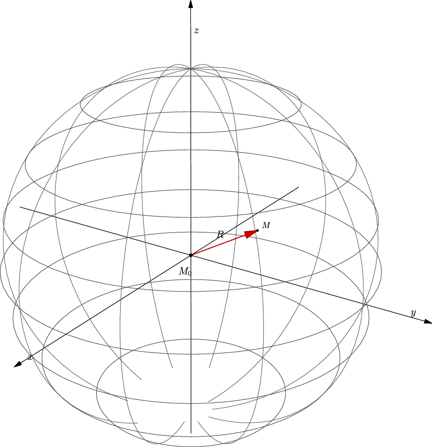
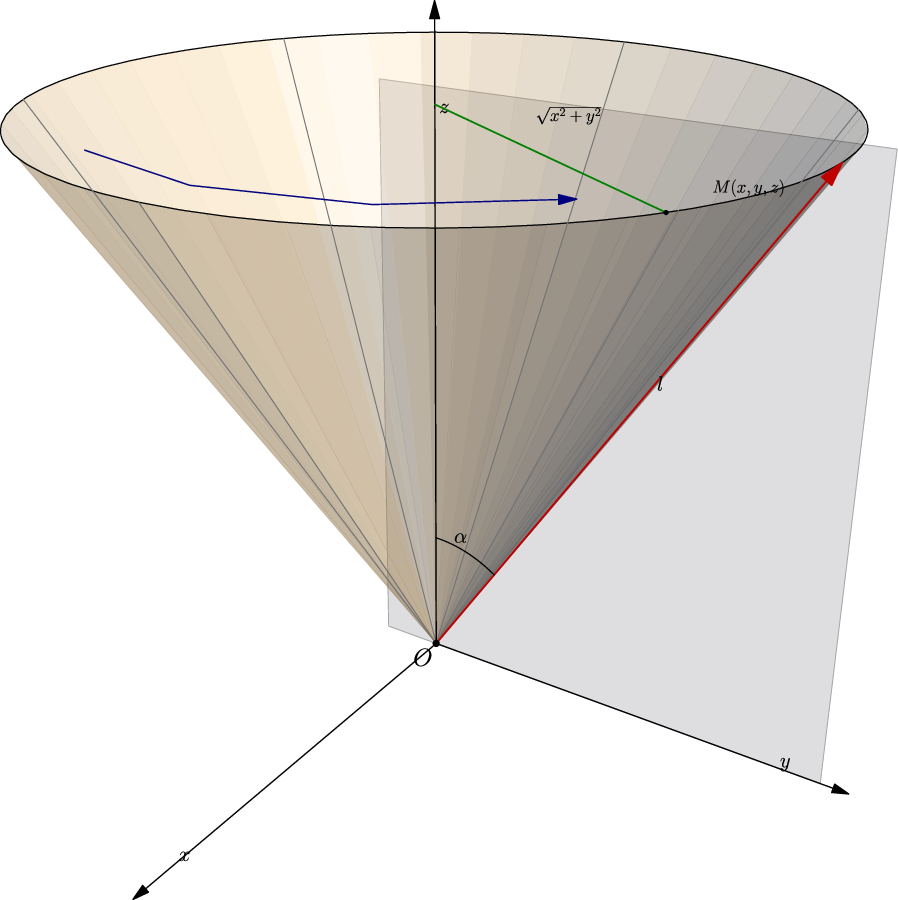
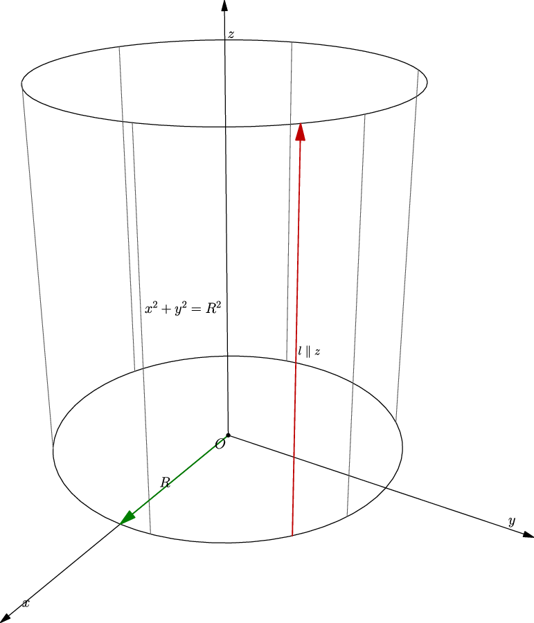
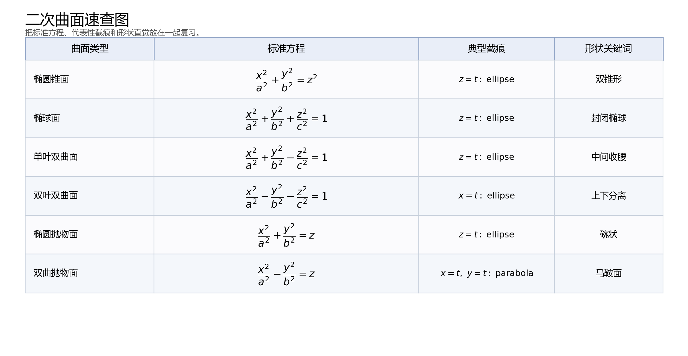

## 6. 曲面及其方程

### 与上一小节的关系

直线和平面是最基本的空间对象。现在转向更一般的曲面：球面、旋转曲面、柱面和常见二次曲面。

### 学习目标

- 会根据几何轨迹建立球面方程。
- 会识别旋转曲面和柱面。
- 会用截痕法初步理解二次曲面形状。
- 能从标准方程判断曲面类型。

### 正文内容

#### 6.1 曲面研究的两个问题

曲面题通常分两类：

1. 已知几何轨迹，建立方程。
2. 已知方程，判断它表示什么曲面。

球面是最典型例子。球心为

$$
M_0(x_0,y_0,z_0),
$$

半径为 $R$ 的球面由条件

$$
|M_0M|=R
$$

给出。因此方程为

$$
(x-x_0)^2+(y-y_0)^2+(z-z_0)^2=R^2.
$$

若球心在原点，则

$$
x^2+y^2+z^2=R^2.
$$

例题：方程

$$
x^2+y^2+z^2-2x+4y=0
$$

配方为

$$
(x-1)^2+(y+2)^2+z^2=5.
$$

所以它表示球心 $(1,-2,0)$、半径 $\sqrt5$ 的球面。

下图把球心 $M_0$、球面上一点 $M$ 和半径 $R$ 的关系直接画出来，对应的就是

$$
|M_0M|=R.
$$

易错点：判断球面时，平方项系数应相同，且没有 $xy,yz,zx$ 项；再通过配方看能否化成标准球面形式。

#### 6.2 旋转曲面

一条平面曲线绕同一平面内的一条直线旋转一周，得到旋转曲面。原曲线叫母线，定直线叫轴。

若 $yOz$ 面上的曲线

$$
f(y,z)=0
$$

绕 $z$ 轴旋转，则旋转时 $z$ 不变，点到 $z$ 轴的距离变为

$$
\sqrt{x^2+y^2}.
$$

所以旋转曲面方程为

$$
f\left(\pm\sqrt{x^2+y^2},z\right)=0.
$$

绕 $y$ 轴旋转时，则把 $z$ 改成

$$
\pm\sqrt{x^2+z^2}.
$$

例题：顶点在原点、旋转轴为 $z$ 轴、半顶角为 $\alpha$ 的圆锥面。母线在 $yOz$ 面上可写为

$$
z=y\cot\alpha.
$$

绕 $z$ 轴旋转，得

$$
z=\pm\sqrt{x^2+y^2}\cot\alpha,
$$

即

$$
z^2=a^2(x^2+y^2),\qquad a=\cot\alpha.
$$

下图把“母线 $l$ 在 $yOz$ 面内绕 $z$ 轴旋转一周形成圆锥面”的关系直接画出来，这样就能直观看出：原来母线方程里的 $y$，旋转后要换成点到 $z$ 轴的距离 $\sqrt{x^2+y^2}$。

#### 6.3 柱面

一条直线沿定曲线平行移动形成的曲面叫柱面。定曲线叫准线，动直线叫母线。

方程

$$
x^2+y^2=R^2
$$

在平面中表示圆；在空间中，因为不含 $z$，表示母线平行于 $z$ 轴的圆柱面。

下图里底面圆满足 $x^2+y^2=R^2$，而红色母线始终平行于 $z$ 轴，所以它正好解释了“方程里不出现 $z$，就表示沿 $z$ 方向无限延伸”的几何含义。

一般地：

- $F(x,y)=0$ 表示母线平行于 $z$ 轴的柱面。
- $G(x,z)=0$ 表示母线平行于 $y$ 轴的柱面。
- $H(y,z)=0$ 表示母线平行于 $x$ 轴的柱面。

例题：$y^2=2x$ 在空间中表示母线平行于 $z$ 轴的抛物柱面。

易错点：方程缺哪个变量，母线就平行于哪个坐标轴。

#### 6.4 二次曲面与截痕法

三元二次方程表示的曲面称为二次曲面。原书介绍的标准二次曲面包括：

椭圆锥面：

$$
\frac{x^2}{a^2}+\frac{y^2}{b^2}=z^2.
$$

椭球面：

$$
\frac{x^2}{a^2}+\frac{y^2}{b^2}+\frac{z^2}{c^2}=1.
$$

单叶双曲面：

$$
\frac{x^2}{a^2}+\frac{y^2}{b^2}-\frac{z^2}{c^2}=1.
$$

双叶双曲面：

$$
\frac{x^2}{a^2}-\frac{y^2}{b^2}-\frac{z^2}{c^2}=1.
$$

椭圆抛物面：

$$
\frac{x^2}{a^2}+\frac{y^2}{b^2}=z.
$$

双曲抛物面：

$$
\frac{x^2}{a^2}-\frac{y^2}{b^2}=z.
$$

还有椭圆柱面、双曲柱面、抛物柱面。

截痕法就是用平面 $z=t$、$x=t$ 或 $y=t$ 去截曲面，看截线怎样变化。例如椭圆锥面

$$
\frac{x^2}{a^2}+\frac{y^2}{b^2}=z^2
$$

用 $z=t$ 截：

- $t=0$ 时，截痕为原点。
- $t\ne0$ 时，截痕为椭圆

$$
\frac{x^2}{(at)^2}+\frac{y^2}{(bt)^2}=1.
$$

所以它像一族随 $|t|$ 增大而放大的椭圆堆出来的双锥面。

双曲抛物面

$$
\frac{x^2}{a^2}-\frac{y^2}{b^2}=z
$$

又叫马鞍面。用 $x=t$ 截，得

$$
-\frac{y^2}{b^2}=z-\frac{t^2}{a^2},
$$

是一族开口朝下的抛物线；其顶点沿

$$
z=\frac{x^2}{a^2},\qquad y=0
$$

移动。

下面这张速查图把本节常见的二次曲面压缩到一张表里。复习时先看标准方程，再对应典型截痕和形状关键词，比孤立地背名称更稳。

---
