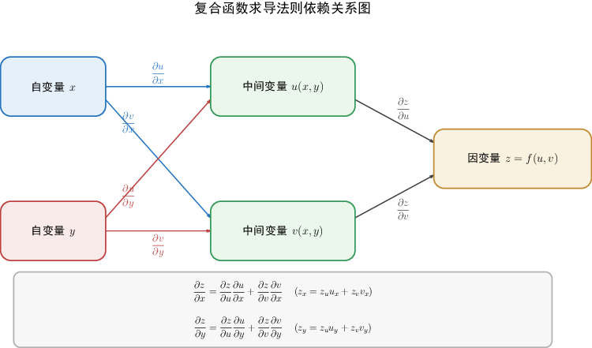

## 5. 复合函数求导：先画变量关系，再沿链相乘相加

### 与上一小节关系

上一小节用全微分描述了“函数值的小变化”：

$$
dz=z_x\,dx+z_y\,dy.
$$

复合函数求导要解决的是另一件事：当 $z$ 不是直接由 $x,y$ 决定，而是先经过 $u,v$ 这类中间变量时，$x,y$ 的变化会怎样一路传到 $z$ 上。

核心想法很简单：

- 先画清楚变量依赖关系；
- 沿着每一条路径把导数相乘；
- 到达同一个目标变量的所有路径相加。

所以这一节不是靠死背公式，而是靠“看路径”写公式。

### 学习目标

- 会根据变量关系图写出链式法则。
- 会区分全导数、偏导数、外层函数偏导数。
- 会用全微分形式不变性快速处理复合求导。
- 能看懂并完成常见的一阶、简单二阶复合偏导计算。

### 正文内容

#### 5.1 一元变量进入多元函数：最后只剩一个自变量

设

$$
z=f(u,v),\qquad u=\varphi(t),\quad v=\psi(t).
$$

这里 $z$ 表面上依赖 $u,v$，但 $u,v$ 又都依赖 $t$。所以最终看，$z$ 只是 $t$ 的函数：

$$
z=f(\varphi(t),\psi(t)).
$$

变量关系可以看成两条路：

$$
t\to u\to z,\qquad t\to v\to z.
$$

因此

$$
\frac{dz}{dt}
=\frac{\partial z}{\partial u}\frac{du}{dt}
+\frac{\partial z}{\partial v}\frac{dv}{dt}.
$$

也常写成

$$
\frac{dz}{dt}=z_u u'(t)+z_v v'(t).
$$

这里的 $\dfrac{dz}{dt}$ 叫全导数，因为 $z$ 最后只随一个变量 $t$ 变化。

如果中间变量有三个：

$$
z=f(u,v,w),\qquad u=u(t),\quad v=v(t),\quad w=w(t),
$$

则每条路都要算：

$$
\frac{dz}{dt}=z_u u'(t)+z_v v'(t)+z_w w'(t).
$$

这类题的重点不是公式有多复杂，而是不要漏掉中间变量。

#### 5.2 多元变量进入多元函数：对谁求偏导，就看谁的路径

设

$$
z=f(u,v),\qquad u=\varphi(x,y),\quad v=\psi(x,y).
$$

此时 $z$ 最后依赖两个变量 $x,y$：

$$
z=f(\varphi(x,y),\psi(x,y)).
$$

对 $x$ 求偏导时，把 $y$ 暂时看成常数。变量路径是

$$
x\to u\to z,\qquad x\to v\to z.
$$

所以

$$
z_x=z_u u_x+z_v v_x.
$$

对 $y$ 求偏导时，把 $x$ 暂时看成常数。变量路径是

$$
y\to u\to z,\qquad y\to v\to z.
$$

所以

$$
z_y=z_u u_y+z_v v_y.
$$

下图把变量依赖关系画成路径图。图中每一条从自变量到 $z$ 的路径都贡献一项。

可以把公式记成一句话：

> 对某个自变量求偏导时，把它通向 $z$ 的所有路径都走一遍；每条路径上的导数相乘，所有路径的结果相加。

#### 5.3 外层函数里直接出现了自变量

有些题不只是

$$
z=f(u,v),\qquad u=u(x,y),\quad v=v(x,y),
$$

而是自变量本身也直接出现在外层函数里。例如

$$
z=f(u,x,y),\qquad u=\varphi(x,y).
$$

这时 $x$ 影响 $z$ 有两条路：

$$
x\to u\to z,\qquad x\to z.
$$

所以

$$
z_x=f_u u_x+f_x.
$$

同理，

$$
z_y=f_u u_y+f_y.
$$

这里最容易混淆的是 $z_x$ 和 $f_x$。

- $z_x$：复合之后的函数 $z=f(\varphi(x,y),x,y)$ 对 $x$ 求偏导，$y$ 固定。
- $f_x$：外层函数 $f(u,x,y)$ 对它自己的第二个变量 $x$ 求偏导，$u,y$ 固定。

简单说，$z_x$ 是“总效果”，$f_x$ 只是其中“直接通过 $x$ 影响外层函数”的那一部分。

#### 5.4 全微分形式不变性：复杂关系可以先写微分

如果

$$
z=f(u,v),
$$

只要 $f$ 可微，不管 $u,v$ 是独立变量，还是由别的变量组成的中间变量，都可以写

$$
dz=z_u\,du+z_v\,dv.
$$

这叫全微分形式不变性。

它的好处是：遇到复杂复合关系时，可以先写最外层的微分，再把中间变量的微分代进去，最后整理 $dx,dy$ 等项的系数。

例如

$$
u=u(x,y),\qquad v=v(x,y),
$$

则

$$
du=u_x\,dx+u_y\,dy,\qquad dv=v_x\,dx+v_y\,dy.
$$

代入

$$
dz=z_u\,du+z_v\,dv,
$$

得到

$$
dz=(z_u u_x+z_v v_x)\,dx+(z_u u_y+z_v v_y)\,dy.
$$

因此

$$
z_x=z_u u_x+z_v v_x,\qquad z_y=z_u u_y+z_v v_y.
$$

这个过程主要是帮助理解：链式法则本质上就是把微小变化沿着变量关系传递，并把不同来源的变化加起来。

#### 5.5 例题 1：一阶偏导的标准做法

设

$$
z=e^u\sin v,\qquad u=xy,\quad v=x+y.
$$

求 $z_x,z_y$。

第一步，先求外层函数对中间变量的偏导：

$$
z_u=e^u\sin v,\qquad z_v=e^u\cos v.
$$

第二步，求中间变量对 $x,y$ 的偏导：

$$
u_x=y,\quad u_y=x,
$$

$$
v_x=1,\quad v_y=1.
$$

第三步，套链式法则：

$$
z_x=z_u u_x+z_v v_x,
$$

所以

$$
z_x=e^u\sin v\cdot y+e^u\cos v\cdot 1.
$$

最后把 $u=xy,\ v=x+y$ 代回：

$$
z_x=e^{xy}\bigl[y\sin(x+y)+\cos(x+y)\bigr].
$$

同理

$$
z_y=z_u u_y+z_v v_y,
$$

即

$$
z_y=e^{xy}\bigl[x\sin(x+y)+\cos(x+y)\bigr].
$$

这道题也可以用全微分做：

$$
dz=e^u\sin v\,du+e^u\cos v\,dv,
$$

而

$$
du=y\,dx+x\,dy,\qquad dv=dx+dy.
$$

代入后整理 $dx,dy$ 的系数，就分别得到 $z_x,z_y$。

#### 5.6 例题 2：高阶复合偏导不要漏掉 $f_u,f_v$ 的变化

设

$$
w=f(x+y+z,\ xyz).
$$

记

$$
u=x+y+z,\qquad v=xyz,
$$

则

$$
w=f(u,v).
$$

先求一阶偏导 $w_x$。因为

$$
u_x=1,\qquad v_x=yz,
$$

所以

$$
w_x=f_u u_x+f_v v_x=f_u+yzf_v.
$$

继续求 $w_{xz}$，也就是对 $w_x$ 再对 $z$ 求偏导。关键点是：$f_u$ 和 $f_v$ 不是常数，它们仍然通过 $u,v$ 依赖 $z$。

先看第一项：

$$
(f_u)_z=f_{uu}u_z+f_{uv}v_z.
$$

又因为

$$
u_z=1,\qquad v_z=xy,
$$

所以

$$
(f_u)_z=f_{uu}+xyf_{uv}.
$$

再看第二项 $yzf_v$。它是乘积：

$$
(yzf_v)_z=yf_v+yz(f_v)_z.
$$

其中

$$
(f_v)_z=f_{vu}u_z+f_{vv}v_z=f_{vu}+xyf_{vv}.
$$

于是

$$
(yzf_v)_z=yf_v+yzf_{vu}+xy^2zf_{vv}.
$$

两部分相加：

$$
w_{xz}
=f_{uu}+xyf_{uv}+yf_v+yzf_{vu}+xy^2zf_{vv}.
$$

如果题目说明二阶偏导连续，则

$$
f_{uv}=f_{vu}.
$$

这类题最常见的失误，是把 $f_u,f_v$ 当成常数。只要还没有把 $f$ 写成具体函数，$f_u,f_v$ 通常仍然是关于 $u,v$ 的函数，继续求导时仍要用链式法则。

#### 5.7 极坐标变换中的两个常用公式

在极坐标中

$$
x=\rho\cos\theta,\qquad y=\rho\sin\theta.
$$

如果

$$
u=f(x,y)=F(\rho,\theta),
$$

那么 $u$ 既可以看成 $x,y$ 的函数，也可以看成 $\rho,\theta$ 的函数。

常用公式有

$$
u_x^2+u_y^2
=u_\rho^2+\frac1{\rho^2}u_\theta^2,
$$

以及

$$
u_{xx}+u_{yy}
=u_{\rho\rho}+\frac1\rho u_\rho+\frac1{\rho^2}u_{\theta\theta}.
$$

第一条公式描述的是梯度长度在直角坐标和极坐标下的对应关系。第二条公式是平面拉普拉斯算子在极坐标下的形式。

这一节不要求把这两个公式完整推导出来。需要理解的是：它们不是新规则，而是链式法则在坐标变换中的应用。考试中如果直接给出极坐标变换，通常重点在于会用公式、会判断每一项来自哪个变量变化。

#### 5.8 易错点整理

1. 不画变量关系，直接套公式，最容易漏项。

2. 每条路径上的导数要相乘，同一个目标变量的所有路径要相加。

3. 外层函数偏导数要看清楚。例如 $f_x$ 表示外层函数对自己某个位置上的 $x$ 求偏导，不一定等于复合后的 $z_x$。

4. 求高阶偏导时，一阶结果里的 $f_u,f_v$ 往往仍是复合函数，继续求导还要继续用链式法则。

5. 最后要把中间变量代回原变量，除非题目要求用 $u,v$ 表示。

6. 若题目要用全微分，先写外层微分，再代入中间变量微分，最后比较 $dx,dy$ 的系数。

### 本节小结

复合函数求导的主线可以压缩成一句话：

$$
\text{沿路径相乘，同目标相加。}
$$

一阶题主要看变量关系图；二阶题要记住一阶结果里的偏导数本身还会变化；极坐标公式则可以看作链式法则在坐标变换中的整理结果。对原理部分，只需要掌握思路：小变化会先传给中间变量，再由中间变量传给外层函数，不同路径带来的影响叠加起来，就是链式法则。
