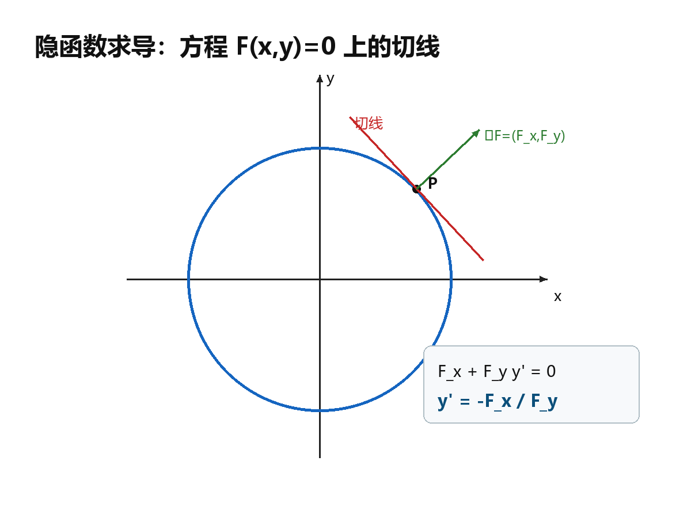

## 6. 隐函数求导：不解出函数也能求导

### 与上一小节关系

复合函数求导处理“函数套函数”。隐函数求导处理“变量被方程绑在一起”。核心仍是链式法则。

### 学习目标

- 会判断一个方程能否在局部确定隐函数。
- 会直接由方程求隐函数的一阶、二阶导数。
- 会处理一个方程、一个三元方程和两个方程组成的方程组。

### 正文内容

#### 6.1 一个方程确定一个函数

设

$$
F(x,y)=0.
$$

若在点 $(x_0,y_0)$ 附近 $F$ 有连续偏导数，且

$$
F(x_0,y_0)=0,\qquad F_y(x_0,y_0)\ne0,
$$

则这个方程在该点附近能唯一确定一个函数 $y=f(x)$，并且

$$
\frac{dy}{dx}=-\frac{F_x}{F_y}.
$$

为什么是这个式子？因为把 $y=f(x)$ 代入方程，得到恒等式

$$
F(x,f(x))\equiv0.
$$

两边对 $x$ 求导：

$$
F_x+F_y\frac{dy}{dx}=0.
$$

解出 $dy/dx$ 就得到公式。

下图从几何上说明这个公式：曲线 $F(x,y)=0$ 的法向量是 $\nabla F=(F_x,F_y)$，切线与法向量垂直，所以得到 $F_x+F_y y'=0$。

#### 6.2 二阶导数

已知

$$
y'=-\frac{F_x}{F_y},
$$

如果 $F$ 有足够连续的二阶偏导数，可以继续把右端看作 $x$ 的复合函数求导：

$$
y''=
-\frac{F_{xx}F_y^2-2F_{xy}F_xF_y+F_{yy}F_x^2}{F_y^3}.
$$

做题时也可以不背这个长公式，直接从

$$
F_x+F_y y'=0
$$

继续对 $x$ 求导，通常更稳。

例：方程

$$
x^2+y^2-1=0
$$

在点 $(0,1)$ 附近确定 $y=f(x)$。这里

$$
F_x=2x,\qquad F_y=2y,\qquad F_y(0,1)=2\ne0.
$$

所以

$$
y'=-\frac{x}{y},\qquad y'(0)=0.
$$

再求导：

$$
y''=-\frac{y-xy'}{y^2}.
$$

代入 $x=0,y=1,y'=0$，得

$$
y''(0)=-1.
$$

#### 6.3 一个三元方程确定二元函数

设

$$
F(x,y,z)=0.
$$

若

$$
F(x_0,y_0,z_0)=0,\qquad F_z(x_0,y_0,z_0)\ne0,
$$

并且偏导数连续，则方程在该点附近确定 $z=f(x,y)$，并且

$$
z_x=-\frac{F_x}{F_z},\qquad
z_y=-\frac{F_y}{F_z}.
$$

例：设

$$
x^2+y^2+z^2-4z=0.
$$

令

$$
F=x^2+y^2+z^2-4z,
$$

则

$$
F_x=2x,\qquad F_z=2z-4.
$$

当 $z\ne2$ 时，

$$
z_x=-\frac{2x}{2z-4}=\frac{x}{2-z}.
$$

继续对 $x$ 求偏导：

$$
z_{xx}
=\frac{(2-z)+xz_x}{(2-z)^2}
=\frac{(2-z)^2+x^2}{(2-z)^3}.
$$

#### 6.4 方程组确定多个函数

方程组

$$
\begin{cases}
F(x,y,u,v)=0,\\
G(x,y,u,v)=0
\end{cases}
$$

可能在局部确定

$$
u=u(x,y),\qquad v=v(x,y).
$$

关键条件是雅可比行列式

$$
J=\frac{\partial(F,G)}{\partial(u,v)}
=
\begin{vmatrix}
F_u & F_v\\
G_u & G_v
\end{vmatrix}
\ne0.
$$

这时可用线性方程组求偏导。例如对 $x$ 求导：

$$
\begin{cases}
F_x+F_u u_x+F_v v_x=0,\\
G_x+G_u u_x+G_v v_x=0.
\end{cases}
$$

解这个线性方程组即可。公式写成行列式为

$$
u_x=-\frac{1}{J}\frac{\partial(F,G)}{\partial(x,v)},
\qquad
v_x=-\frac{1}{J}\frac{\partial(F,G)}{\partial(u,x)}.
$$

对 $y$ 求偏导同理。

#### 6.5 易错点

- 隐函数存在定理里的分母条件很重要。求 $y'$ 要求 $F_y\ne0$，求 $z_x,z_y$ 要求 $F_z\ne0$。
- 不要先强行解出 $y$ 或 $z$。很多题显化很麻烦，隐式求导反而最直接。
- 对方程组求导时，未知量是 $u_x,v_x$ 或 $u_y,v_y$，它们要作为线性方程组的未知数来解。
- 二阶导数最容易漏掉 $y$ 或 $z$ 本身也随自变量变化。

证明处理：隐函数存在定理不证明；求导公式保留推导，因为它就是链式法则的标准应用，做题价值很高。

