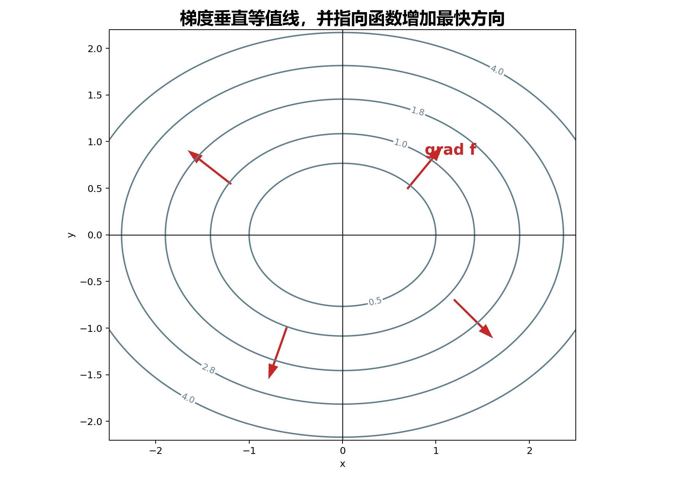

## 8. 方向导数与梯度：任意方向上的变化率

### 与上一小节关系

几何应用说明偏导能给出坐标方向上的切线和法向量。但变化不一定只沿坐标轴发生。本小节把变化率推广到任意方向，并引出梯度。

### 学习目标

- 会计算方向导数。
- 理解梯度的方向是函数增加最快的方向，梯度的模是最大方向导数。
- 会用梯度求等值线、等值面的法向量。

### 正文内容

#### 8.1 方向导数

设 $l$ 是从点 $P_0(x_0,y_0)$ 出发的一条射线，方向单位向量为

$$
\mathbf e_l=(\cos\alpha,\cos\beta).
$$

方向导数定义为

$$
\left.\frac{\partial f}{\partial l}\right|_{(x_0,y_0)}
=\lim_{t\to0^+}
\frac{f(x_0+t\cos\alpha,y_0+t\cos\beta)-f(x_0,y_0)}{t}.
$$

如果 $f$ 在 $P_0$ 可微，则

$$
\left.\frac{\partial f}{\partial l}\right|_{(x_0,y_0)}
=f_x(x_0,y_0)\cos\alpha+f_y(x_0,y_0)\cos\beta.
$$

三元函数同理。若方向单位向量为

$$
\mathbf e_l=(\cos\alpha,\cos\beta,\cos\gamma),
$$

则

$$
\frac{\partial f}{\partial l}
=f_x\cos\alpha+f_y\cos\beta+f_z\cos\gamma.
$$

大白话说：方向导数就是沿指定方向走一小步时，函数值每单位距离变化多少。

#### 8.2 例题

例 1：求

$$
z=xe^{2y}
$$

在 $P(1,0)$ 处沿从 $P$ 到 $Q(2,-1)$ 的方向的方向导数。

方向向量

$$
\overrightarrow{PQ}=(1,-1),
$$

单位方向向量为

$$
\mathbf e_l=\left(\frac1{\sqrt2},-\frac1{\sqrt2}\right).
$$

$$
z_x=e^{2y},\qquad z_y=2xe^{2y}.
$$

在 $(1,0)$ 处：

$$
z_x=1,\qquad z_y=2.
$$

方向导数为

$$
1\cdot\frac1{\sqrt2}+2\cdot\left(-\frac1{\sqrt2}\right)
=-\frac{\sqrt2}{2}.
$$

例 2：求 $f(x,y,z)=xy+yz+zx$ 在点 $(1,1,2)$ 沿方向角 $60^\circ,45^\circ,60^\circ$ 的方向导数。

单位方向向量：

$$
\mathbf e=\left(\frac12,\frac{\sqrt2}{2},\frac12\right).
$$

$$
f_x=y+z,\qquad f_y=x+z,\qquad f_z=x+y.
$$

代入 $(1,1,2)$：

$$
f_x=3,\qquad f_y=3,\qquad f_z=2.
$$

所以

$$
D_{\mathbf e}f
=3\cdot\frac12+3\cdot\frac{\sqrt2}{2}+2\cdot\frac12
=\frac12(5+3\sqrt2).
$$

#### 8.3 梯度

二元函数的梯度定义为

$$
\nabla f(x,y)=f_x(x,y)\mathbf i+f_y(x,y)\mathbf j.
$$

三元函数的梯度定义为

$$
\nabla f(x,y,z)
=f_x\mathbf i+f_y\mathbf j+f_z\mathbf k.
$$

方向导数可以写成点积：

$$
D_{\mathbf e}f=\nabla f\cdot \mathbf e.
$$

因此

$$
D_{\mathbf e}f=|\nabla f|\cos\theta,
$$

其中 $\theta$ 是梯度与方向 $\mathbf e$ 的夹角。

结论：

- 沿 $\nabla f$ 方向，函数增加最快，最大变化率为 $|\nabla f|$。
- 沿 $-\nabla f$ 方向，函数减少最快，最小变化率为 $-|\nabla f|$。
- 沿与 $\nabla f$ 垂直的方向，方向导数为 $0$。

例：设

$$
f(x,y)=\frac12(x^2+y^2),\qquad P_0(1,1).
$$

$$
\nabla f=(x,y),\qquad \nabla f(1,1)=(1,1).
$$

增加最快方向的单位向量为

$$
\frac{1}{\sqrt2}(1,1),
$$

最大方向导数为

$$
|\nabla f(1,1)|=\sqrt2.
$$

减少最快方向为

$$
-\frac{1}{\sqrt2}(1,1),
$$

方向导数为 $-\sqrt2$。变化率为零的方向垂直于 $(1,1)$，例如

$$
\frac{1}{\sqrt2}(-1,1),\qquad \frac{1}{\sqrt2}(1,-1).
$$

#### 8.4 梯度与等值线、等值面

二元函数的等值线是

$$
f(x,y)=c.
$$

在等值线上，函数值不变，所以沿切线方向的变化率为 $0$。因此梯度与等值线切线垂直，是等值线的法向量。

三元函数的等值面是

$$
f(x,y,z)=c.
$$

梯度 $\nabla f$ 是等值面的法向量。这与第 7 节的曲面法向量公式一致：曲面 $F(x,y,z)=0$ 的法向量就是 $\nabla F$。

下图中灰色曲线是等值线，红色箭头表示梯度方向。梯度总是垂直于等值线，并指向函数值增加最快的方向。

例：曲面

$$
x^2+y^2+z=9
$$

在 $P_0(1,2,4)$ 处。令

$$
f(x,y,z)=x^2+y^2+z.
$$

$$
\nabla f(P_0)=(2,4,1).
$$

切平面：

$$
2(x-1)+4(y-2)+(z-4)=0,
$$

即

$$
2x+4y+z=14.
$$

法线可写成

$$
x=1+2t,\qquad y=2+4t,\qquad z=4+t.
$$

#### 8.5 梯度场

如果空间中每个点对应一个数量 $f(M)$，称为数量场。若每个点对应一个向量 $\mathbf F(M)$，称为向量场。

由数量函数 $f$ 产生的向量场

$$
\nabla f
$$

称为梯度场。若某向量场能写成某个函数的梯度，就称这个函数为势函数，这个向量场为势场。

源文例：数量场

$$
\frac{m}{r},\qquad r=\sqrt{x^2+y^2+z^2}
$$

的梯度为

$$
\nabla\frac{m}{r}
=-\frac{m}{r^2}\mathbf e_r,
$$

其中

$$
\mathbf e_r=\frac{x}{r}\mathbf i+\frac{y}{r}\mathbf j+\frac{z}{r}\mathbf k.
$$

它可解释为指向原点、大小与 $1/r^2$ 成正比的引力场。

#### 8.6 易错点

- 方向导数公式中的方向向量必须是单位向量。
- 方向导数按射线定义，$t\to0^+$。换成相反方向，符号通常会变。
- 梯度为零时，没有唯一的“增加最快方向”；若函数可微，各方向导数都为 $0$。
- 用 $\nabla f\cdot \mathbf e$ 之前要确认函数在该点可微。

证明处理：方向导数公式保留证明思路：把 $\Delta x,\Delta y$ 写成 $t\cos\alpha,t\cos\beta$，代入全微分后除以 $t$。

