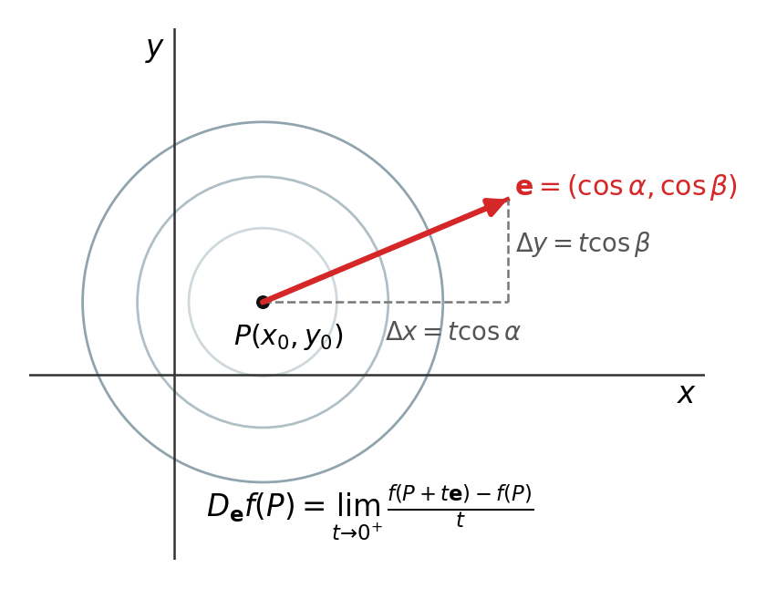
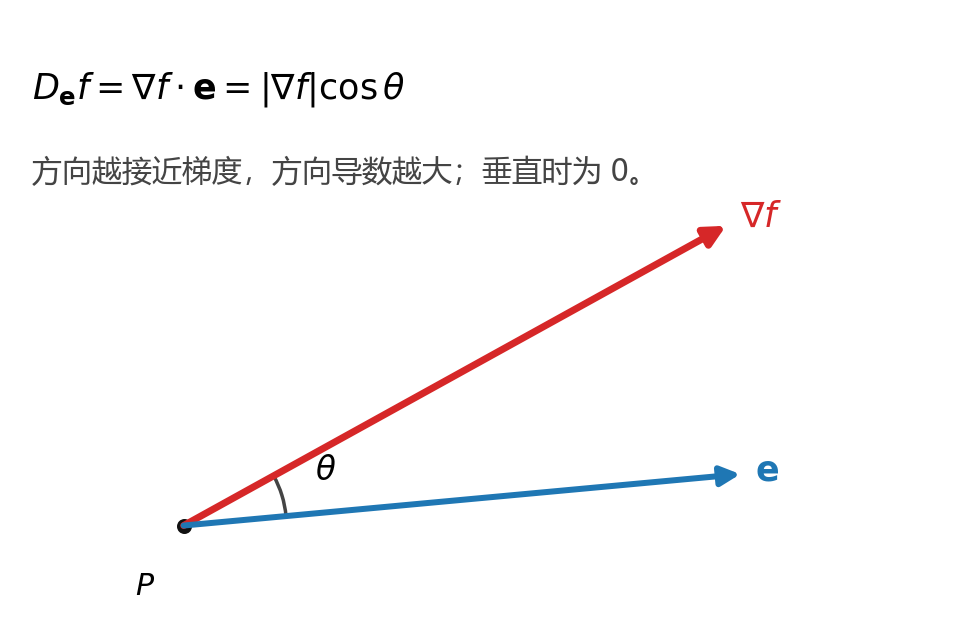
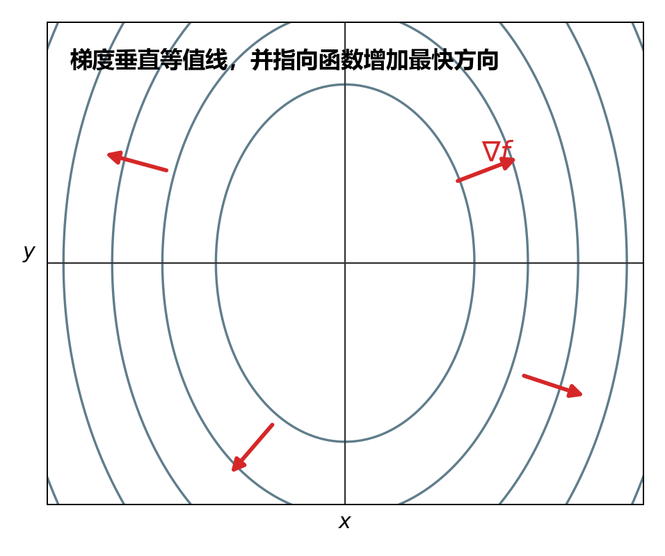
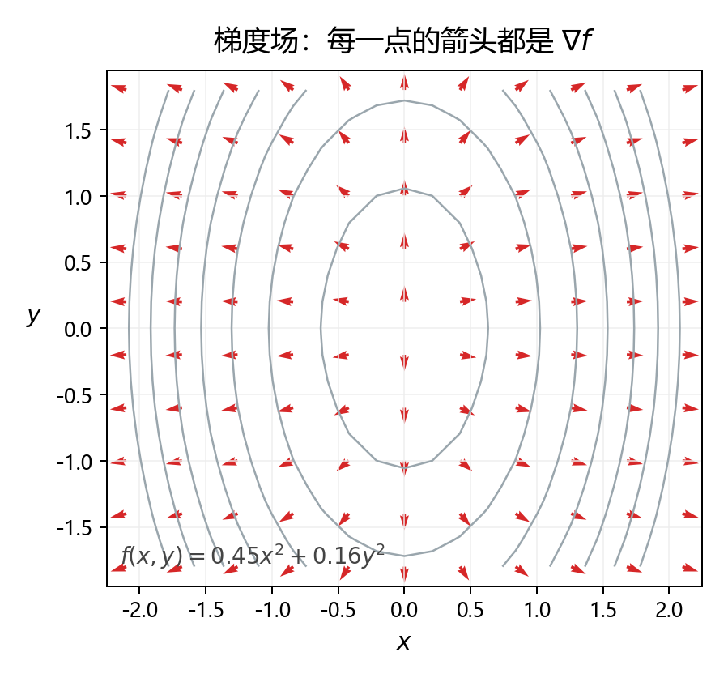

## 8. 方向导数与梯度：任意方向上的变化率

### 与上一小节关系

上一节把偏导数用到几何上——求切线、切平面、法线，但全都是沿坐标轴方向。这一节回答一个更一般的问题：**往任意方向走，函数变化有多快？**答案就是方向导数。而方向导数写成点积之后，自然就「挤」出了梯度这个向量——它不依赖于方向，是函数在某点的**固有属性**：指向最陡的上升方向。

### 学习目标

- 理解方向导数是什么，会计算任意方向上的变化率。
- 理解梯度为什么是「最陡方向」，而不是一个硬背的结论。
- 会用梯度求等值线 / 等值面的法向量。

---

### 8.1 偏导数够用吗？——引入方向导数的动机

偏导数 $f_x$、$f_y$ 告诉我们：沿 $x$ 轴走、沿 $y$ 轴走，函数各变多少。但实际问题里，方向不一定非得沿着坐标轴。

举一个地理直觉：

> 你站在一座山上。往正东走，每走一米上升 0.1 米；往正北走，每走一米上升 0.2 米。那往**东北方向**走呢？每走一米上升多少？

偏导数回答不了这个问题，因为东北方向不是任何一个坐标轴。我们需要一个能处理**任意方向**的工具——这就是**方向导数**。

---

### 8.2 方向导数：沿指定方向的变化率

设有一条从点 $P_0(x_0,y_0)$ 出发的射线，方向由单位向量

$$
\mathbf e_l = (\cos\alpha,\ \cos\beta)
$$

指定。我们在射线上取一点 $(x_0 + t\cos\alpha,\ y_0 + t\cos\beta)$，让 $t \to 0^+$，看函数值的变化：

$$
\boxed{
\left.\frac{\partial f}{\partial l}\right|_{(x_0,y_0)}
= \lim_{t \to 0^+}
\frac{f(x_0 + t\cos\alpha,\ y_0 + t\cos\beta) - f(x_0,y_0)}{t}
}
$$

这就是**方向导数**的定义——沿方向 $\mathbf e_l$ 走一小步，函数值每单位距离变化多少。



**但如果每次都要代定义式算极限，太麻烦了。** 好在：如果 $f$ 在 $P_0$ 处**可微**，方向导数有一个极其简洁的计算公式：

$$
\boxed{
\left.\frac{\partial f}{\partial l}\right|_{(x_0,y_0)}
= f_x(x_0,y_0) \cos\alpha + f_y(x_0,y_0) \cos\beta
}
$$

三元函数完全类似。若方向单位向量为 $\mathbf e_l = (\cos\alpha,\ \cos\beta,\ \cos\gamma)$，则

$$
\frac{\partial f}{\partial l}
= f_x\cos\alpha + f_y\cos\beta + f_z\cos\gamma.
$$

**这个公式的意思是：** 任意方向上的变化率，等于 $x$ 方向变化率 $\times$ 该方向在 $x$ 轴的分量 + $y$ 方向变化率 $\times$ 该方向在 $y$ 轴的分量。本质上是把变化率向这个方向做「投影」。

---

### 8.3 例题：方向导数的计算

**例 1**：求 $z = xe^{2y}$ 在 $P(1,0)$ 处沿从 $P$ 到 $Q(2,-1)$ 的方向的方向导数。

先求方向：$\overrightarrow{PQ} = (1, -1)$，单位化为

$$
\mathbf e_l = \left(\frac{1}{\sqrt2},\ -\frac{1}{\sqrt2}\right).
$$

求偏导：

$$
z_x = e^{2y}, \qquad z_y = 2xe^{2y}.
$$

在 $(1,0)$ 处：$z_x = 1$，$z_y = 2$。

代入公式：

$$
\left.\frac{\partial z}{\partial l}\right|_{(1,0)}
= 1 \cdot \frac{1}{\sqrt2} + 2 \cdot \left(-\frac{1}{\sqrt2}\right)
= -\frac{\sqrt2}{2}.
$$

负号说明：沿 $P \to Q$ 方向走，函数值是**下降**的。

---

**例 2**：求 $f(x,y,z) = xy + yz + zx$ 在点 $(1,1,2)$ 沿方向角为 $60^\circ,\ 45^\circ,\ 60^\circ$ 的方向导数。

方向角的意思是：该方向与 $x$、$y$、$z$ 轴正方向的夹角分别是 $60^\circ, 45^\circ, 60^\circ$。因此单位方向向量为：

$$
\mathbf e = \left(\cos 60^\circ,\ \cos 45^\circ,\ \cos 60^\circ\right)
= \left(\frac12,\ \frac{\sqrt2}{2},\ \frac12\right).
$$

求偏导：

$$
f_x = y+z, \qquad f_y = x+z, \qquad f_z = x+y.
$$

代入 $(1,1,2)$：

$$
f_x = 3, \qquad f_y = 3, \qquad f_z = 2.
$$

方向导数：

$$
D_{\mathbf e}f
= 3\cdot\frac12 + 3\cdot\frac{\sqrt2}{2} + 2\cdot\frac12
= \frac12(5 + 3\sqrt2).
$$

---

### 8.4 梯度：从方向导数中「挤」出来的向量

仔细观察方向导数的计算公式：

$$
D_{\mathbf e}f = f_x\cos\alpha + f_y\cos\beta.
$$

右边是两个向量做**点积**的形式：

$$
(f_x,\ f_y) \cdot (\cos\alpha,\ \cos\beta).
$$

于是我们很自然地把第一个向量单独拎出来，给它一个名字——**梯度**：

$$
\boxed{\nabla f(x,y) = f_x(x,y)\,\mathbf i + f_y(x,y)\,\mathbf j
= (f_x,\ f_y)}
$$

三元：

$$
\boxed{\nabla f(x,y,z) = f_x\,\mathbf i + f_y\,\mathbf j + f_z\,\mathbf k
= (f_x,\ f_y,\ f_z)}
$$

**方向导数就可以写成极简形式：**

$$
\boxed{D_{\mathbf e}f = \nabla f \cdot \mathbf e}
$$

---

### 8.5 真正的核心：$\nabla f \cdot \mathbf e = |\nabla f| \cos\theta$

因为 $\mathbf e$ 是单位向量，由点积的性质：

$$
D_{\mathbf e}f = \nabla f \cdot \mathbf e = |\nabla f| \cdot |\mathbf e| \cdot \cos\theta
= |\nabla f| \cos\theta,
$$

其中 $\theta$ 是梯度 $\nabla f$ 与方向 $\mathbf e$ 之间的夹角。



**这个公式揭示了梯度的一切：**

| $\theta$ | $\cos\theta$ | 含义 |
|:--------:|:------------:|------|
| $0$ | $1$ | $\mathbf e$ 与 $\nabla f$ **同向** → 方向导数取**最大值** $|\nabla f|$，函数**增加最快** |
| $\pi$ | $-1$ | $\mathbf e$ 与 $\nabla f$ **反向** → 方向导数取**最小值** $-|\nabla f|$，函数**减少最快** |
| $\pi/2$ | $0$ | $\mathbf e$ **垂直**于 $\nabla f$ → 方向导数为 $0$，函数**瞬时不变** |

**一个点的梯度，是该点的「固有属性」——它不依赖于你选什么方向。** 无论你选哪个方向走，变化率都可以用梯度在你那个方向上的投影算出来（投影长 $|\nabla f|\cos\theta$）。而投影最大的方向，当然就是梯度自己的方向。

> **梯度 = 函数增加最快的方向，梯度的模 = 最大的方向导数。**

---

### 8.6 例题：梯度的应用

设 $f(x,y) = \frac12(x^2 + y^2)$，$P_0(1,1)$。

梯度：

$$
\nabla f = (x,\ y), \qquad \nabla f(1,1) = (1, 1).
$$

- **增加最快的方向**：$\displaystyle \frac{1}{\sqrt2}(1,1)$，最大方向导数 $|\nabla f| = \sqrt2$。
- **减少最快的方向**：$\displaystyle -\frac{1}{\sqrt2}(1,1)$，方向导数 $-\sqrt2$。
- **变化率为零的方向**（与 $(1,1)$ 垂直）：$\displaystyle \frac{1}{\sqrt2}(-1,1)$ 和 $\displaystyle \frac{1}{\sqrt2}(1,-1)$。

这完全符合直觉：$f = \frac12(x^2+y^2)$ 是一个开口向上的抛物面，从 $(1,1)$ 出发，沿径向（背离原点）走，上升最快。

---

### 8.7 梯度的几何意义：永远是等值线的法向量

二元函数 $f(x,y)$ 的**等值线**是 $f(x,y) = c$。

你在等值线上走，函数值不变 → 沿切线方向，方向导数为 $0$ → 切线方向与梯度**垂直**。所以：

> **梯度 $\nabla f$ 永远垂直于等值线，指向函数值增大的那一侧。**



推广到三元：$f(x,y,z) = c$ 是等值面，梯度 $\nabla f$ 就是等值面的**法向量**。这和上一节用隐函数求导得到的法向量公式完全一致。

---

**例**：曲面 $x^2 + y^2 + z = 9$ 在 $P_0(1,2,4)$ 处的切平面与法线。

令 $f(x,y,z) = x^2 + y^2 + z$，则

$$
\nabla f = (2x,\ 2y,\ 1), \qquad \nabla f(P_0) = (2,\ 4,\ 1).
$$

切平面方程：

$$
2(x-1) + 4(y-2) + 1 \cdot (z-4) = 0,
$$

即

$$
2x + 4y + z = 14.
$$

法线参数方程：

$$
x = 1 + 2t,\quad y = 2 + 4t,\quad z = 4 + t.
$$

---

### 8.8 推广到整个空间：梯度场与势函数

#### 8.8.1 什么是「场」？——用天气预报来理解

看天气预报时，有两类图你一定见过：

**第一类：温度分布图。** 地图上每个城市标一个数字（25°C、28°C……）。每个位置 → 一个数字 → 这叫**数量场**。

你学的函数 $f(x,y)$ 本质上就是一个数量场：平面上每一点 $(x,y)$ 对应一个高度 $f(x,y)$，就像地图上每座城市对应一个温度。

```
数量场 = 每个点一个数字
```

**第二类：风向图。** 地图上每个城市画一个小箭头（→ ↗ ↑），有长度（风速）有方向（风向）。每个位置 → 一个向量 → 这叫**向量场**。

```
向量场 = 每个点一个箭头
```

**就这么简单。**「场」没有任何神秘的东西——就是给空间中每个点分配一个东西。分配数字就是数量场，分配箭头就是向量场。

---

#### 8.8.2 从数量场到向量场：梯度场

回到你的函数 $f(x,y) = \frac12(x^2 + y^2)$。

我们之前只在 $(1,1)$ 这一个点算了梯度 $\nabla f(1,1) = (1,1)$。但如果对**平面上所有点**都算一遍梯度呢？

```
点 (0,0) → 梯度 (0,0)     ← 原点处最平，没有箭头
点 (1,0) → 梯度 (1,0)     ← 箭头指向右
点 (0,1) → 梯度 (0,1)     ← 箭头指向上
点 (1,1) → 梯度 (1,1)     ← 箭头指向右上
点 (2,2) → 梯度 (2,2)     ← 离原点越远，箭头越长（越陡）
```

整张图上**每个点都长出了一个小箭头**——这就是一个向量场。因为它是由 $f$ 的梯度生成的，专门叫**梯度场**。

> **梯度场 = 对数量场每个点求梯度，得到满图的箭头**

下图把梯度场（红色箭头）叠在等值线（灰色曲线）上：箭头总是垂直于等值线，指向高度增加的方向。



---

#### 8.8.3 反过来：势函数

上面的逻辑是：

$$
\text{数量场 } f \quad \xrightarrow{\text{求梯度}} \quad \text{向量场 } \nabla f
$$

现在**倒过来**想：如果我手里已经有了一个向量场（一堆箭头），我发现这些箭头恰好可以写成某个函数 $f$ 的梯度——也就是说存在一个 $f$ 使得 $\nabla f = \mathbf F$——

那这个 $f$ 就叫**势函数**，这个向量场就叫**势场**。

**物理学里的例子：**

把一块石头放在空间中，它周围每个点都会感受到引力——每个点有一个指向石头的箭头（引力场）。这个引力场恰好是「引力势能」这个数量场的梯度。引力势能就是势函数，引力场就是势场。静电场同理：电势是势函数，电场是势场。

**数学上：**

$$
\boxed{\text{势场 = 能写成某个函数梯度的向量场}}
$$

---

#### 8.8.4 经典例子：$\frac{m}{r}$ 的梯度场

考虑数量场

$$
f = \frac{m}{r}, \qquad r = \sqrt{x^2 + y^2 + z^2}.
$$

（$m$ 是常数，$r$ 是到原点的距离。离原点越远，函数值越小。）

它的梯度是：

$$
\nabla f
= \nabla\left(\frac{m}{r}\right)
= -\frac{m}{r^2}\,\mathbf e_r,
\quad \mathbf e_r = \left(\frac{x}{r},\ \frac{y}{r},\ \frac{z}{r}\right).
$$

解读：

- **方向**：$-\mathbf e_r$，指向原点（径向向内）
- **大小**：$\frac{m}{r^2}$，与距离的平方成反比
- **物理含义**：这就是牛顿万有引力场的形式——$\frac{m}{r}$ 是引力势函数，它的梯度就是引力场

---

#### 8.8.5 一句话总结

```
数量场（每点一个数字）
     ↓ 每个点求梯度
梯度场 / 向量场（满图的小箭头，指向数字增长最快的方向）
     ↓ 如果一个向量场能写成某个函数 f 的梯度
那 f 就叫势函数，这个向量场就叫势场
     ↓ 物理里最重要的势场
引力场、静电场（都是某个势函数的梯度）
```

这一节不用死记，知道「场就是分配到每个点」「梯度场就是每个点的梯度凑成的向量场」「势函数就是梯度场的原函数」就足够应对考试了。

---

### 8.9 易错点

1. **方向向量必须是单位向量。** 公式 $D_{\mathbf e}f = \nabla f \cdot \mathbf e$ 中的 $\mathbf e$ 若没有单位化，结果就会错。
2. **方向导数定义用的是 $t \to 0^+$（单侧极限）。** 沿相反方向走，方向导数通常反号。
3. **梯度为零时，没有唯一的「最快方向」。** 如果某点 $\nabla f = \mathbf 0$ 且函数可微，则该点沿所有方向的方向导数都是 $0$——它可能是极值点或鞍点（第 9 节会展开）。
4. **用 $\nabla f \cdot \mathbf e$ 之前，确认函数在该点可微。** 不可微时，方向导数不一定能用这个公式算。

---

### 证明思路

方向导数公式的推导思路比较直接，不用死记：

把全微分中的 $\Delta x$、$\Delta y$ 分别写成 $t\cos\alpha$、$t\cos\beta$（这就是沿方向走 $t$ 距离在坐标轴上的分量），代入

$$
\Delta f \approx f_x \cdot t\cos\alpha + f_y \cdot t\cos\beta,
$$

两边除以 $t$ 后取 $t \to 0^+$，即得上方的计算公式。本质上就是把全微分的近似式在两个坐标轴上做了分解。
