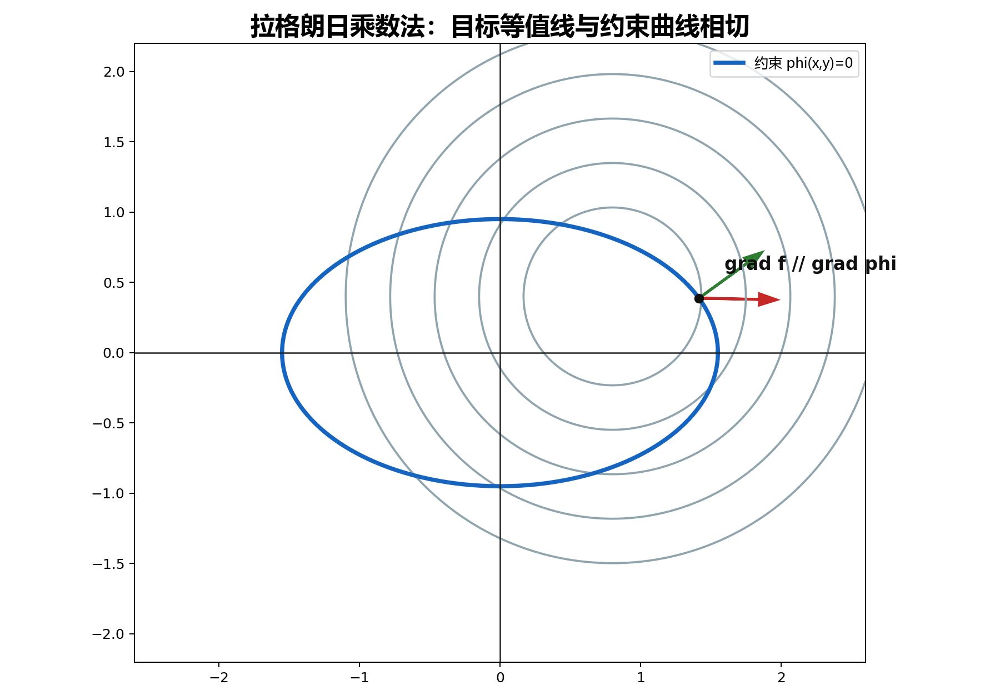

## 9. 多元函数极值：驻点、边界与拉格朗日乘数法

### 与上一小节关系

梯度告诉我们函数增加最快的方向。极值点附近若函数可微，不能再向任何方向一阶增加或减少，所以梯度通常会变成零向量。本小节把这一点发展成求极值的方法。

### 学习目标

- 会求无条件极值、最大值和最小值。
- 会用二阶偏导判别驻点性质。
- 会用拉格朗日乘数法处理有约束的极值问题。

### 正文内容

#### 9.1 极值的定义

若在点 $(x_0,y_0)$ 的某邻域内，对所有异于 $(x_0,y_0)$ 的点都有

$$
f(x,y)<f(x_0,y_0),
$$

则 $f(x_0,y_0)$ 是极大值。

若都有

$$
f(x,y)>f(x_0,y_0),
$$

则 $f(x_0,y_0)$ 是极小值。

极值是局部概念，只比较附近点；最大值和最小值是整体概念，要和整个区域内所有点比较。

例：

- $z=3x^2+4y^2$ 在 $(0,0)$ 有极小值。
- $z=-\sqrt{x^2+y^2}$ 在 $(0,0)$ 有极大值，但偏导数不存在。
- $z=xy$ 在 $(0,0)$ 没有极值，因为附近既有正值也有负值。

#### 9.2 无条件极值

必要条件：若 $f$ 在 $(x_0,y_0)$ 有偏导数且取得极值，则

$$
f_x(x_0,y_0)=0,\qquad f_y(x_0,y_0)=0.
$$

满足这两个方程的点叫驻点。

注意：极值点若偏导存在，则一定是驻点；但驻点不一定是极值点。

二阶充分条件：设

$$
A=f_{xx}(x_0,y_0),\qquad B=f_{xy}(x_0,y_0),\qquad C=f_{yy}(x_0,y_0),
$$

并且 $(x_0,y_0)$ 是驻点。令

$$
D=AC-B^2.
$$

则：

- $D>0,A>0$：极小值。
- $D>0,A<0$：极大值。
- $D<0$：无极值。
- $D=0$：不能判断，要另作讨论。

操作流程：

1. 解

$$
f_x=0,\qquad f_y=0
$$

得到驻点。
2. 对每个驻点计算 $A,B,C,D$。
3. 按判别法分类。
4. 若有偏导不存在的点，也要单独检查。

例：求

$$
f(x,y)=x^3-y^3+3x^2+3y^2-9x
$$

的极值。

$$
f_x=3x^2+6x-9,\qquad f_y=-3y^2+6y.
$$

驻点为

$$
(1,0),\quad (1,2),\quad (-3,0),\quad (-3,2).
$$

二阶偏导：

$$
f_{xx}=6x+6,\qquad f_{xy}=0,\qquad f_{yy}=-6y+6.
$$

逐点判断：

- $(1,0)$：$D=12\cdot6>0,A>0$，极小值，$f(1,0)=-5$。
- $(1,2)$：$D=12\cdot(-6)<0$，无极值。
- $(-3,0)$：$D=(-12)\cdot6<0$，无极值。
- $(-3,2)$：$D=(-12)\cdot(-6)>0,A<0$，极大值，$f(-3,2)=31$。

#### 9.3 最大值与最小值

若 $f$ 在有界闭区域 $D$ 上连续，则一定取得最大值和最小值。它们可能出现在：

- 区域内部的驻点。
- 偏导不存在的内部点。
- 边界上。

一般流程是：比较所有候选点的函数值，最大者为最大值，最小者为最小值。

实际应用题常常可以根据问题本身判断最大值或最小值一定存在，且只可能在内部取得。若内部只有一个驻点，就可直接断定它是所求最值点。

例：体积为 $2\text{ m}^3$ 的有盖长方体水箱，用料最省时尺寸如何？

设长、宽为 $x,y$，高为

$$
\frac{2}{xy}.
$$

表面积

$$
A=2\left(xy+\frac2x+\frac2y\right),\qquad x>0,y>0.
$$

求偏导：

$$
A_x=2\left(y-\frac2{x^2}\right),\qquad
A_y=2\left(x-\frac2{y^2}\right).
$$

解得

$$
x=y=\sqrt[3]{2}.
$$

高为

$$
\frac{2}{xy}=\sqrt[3]{2}.
$$

所以用料最省时是正方体。

#### 9.4 条件极值与拉格朗日乘数法

如果目标函数的自变量还要满足附加条件，就叫条件极值。

求

$$
z=f(x,y)
$$

在约束

$$
\varphi(x,y)=0
$$

下的可能极值点，构造

$$
L(x,y)=f(x,y)+\lambda\varphi(x,y).
$$

解方程组

$$
\begin{cases}
f_x+\lambda\varphi_x=0,\\
f_y+\lambda\varphi_y=0,\\
\varphi(x,y)=0.
\end{cases}
$$

得到的点是可能极值点，最后还要结合题意或进一步判别。

几何上，拉格朗日乘数法对应“目标函数的等值线与约束曲线相切”。此时两条曲线的法向量方向平行，也就是

$$
\nabla f\parallel \nabla\varphi.
$$

多变量、多约束时类似。例如

$$
u=f(x,y,z,t)
$$

有两个约束

$$
\varphi=0,\qquad \psi=0,
$$

就令

$$
L=f+\lambda\varphi+\mu\psi.
$$

#### 9.5 拉格朗日例题

求表面积为 $a^2$ 的长方体中体积最大的长方体。

设三棱长为 $x,y,z$，目标函数

$$
V=xyz,
$$

约束

$$
2xy+2yz+2xz-a^2=0.
$$

构造

$$
L=xyz+\lambda(2xy+2yz+2xz-a^2).
$$

令偏导为 $0$：

$$
\begin{cases}
yz+2\lambda(y+z)=0,\\
xz+2\lambda(x+z)=0,\\
xy+2\lambda(x+y)=0.
\end{cases}
$$

结合 $x,y,z>0$，可推出

$$
x=y=z.
$$

代入约束：

$$
6x^2=a^2,
\qquad
x=y=z=\frac{\sqrt6}{6}a.
$$

最大体积为

$$
V_{\max}=\left(\frac{\sqrt6}{6}a\right)^3
=\frac{\sqrt6}{36}a^3.
$$

源文还给出电视机最优价格模型。它的本质仍是：把利润写成目标函数，把销售量、成本与价格之间的关系写成约束，再用拉格朗日乘数法求可能最优价格。

#### 9.6 易错点

- 驻点只是候选点，不是极值点的保证。
- $D=AC-B^2=0$ 时不能下结论。
- 求闭区域上的最大值、最小值时，边界必须考虑。
- 拉格朗日乘数法给的是可能极值点，最后要结合题意确认最大或最小是否存在。
- 有些极值点偏导不存在，不能因为不是驻点就漏掉。

证明处理：极值必要条件保留证明思路，即固定一个变量变成一元极值问题；二阶充分条件推迟到泰勒公式后用二次型直觉解释，不展开全部技术证明。

