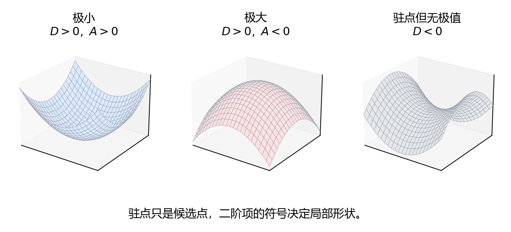
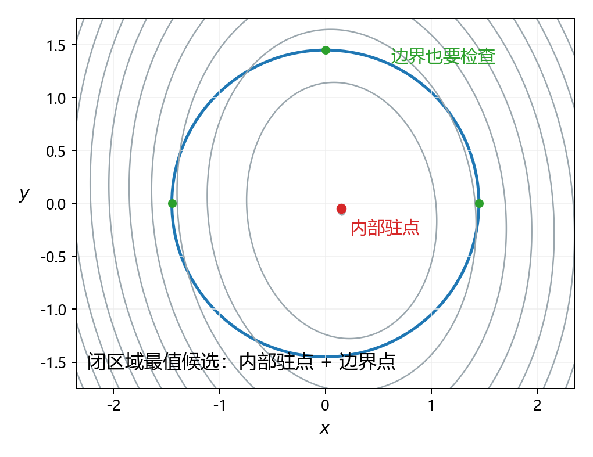
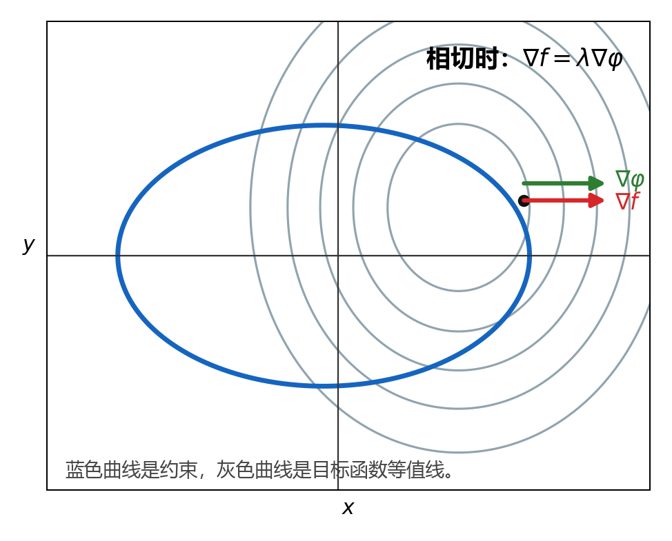
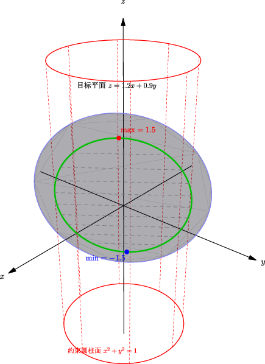

## 9. 多元函数极值：驻点、边界与拉格朗日乘数法

### 与上一小节关系

梯度告诉我们函数增加最快的方向。极值点附近若函数可微，不能再向任何方向一阶增加或减少，所以梯度通常会变成零向量。本小节把这一点发展成求极值的方法。

### 学习目标

- 会求无条件极值、最大值和最小值。
- 会用二阶偏导判别驻点性质。
- 会用拉格朗日乘数法处理有约束的极值问题。

### 正文内容

#### 9.1 极值的定义

若在点 $(x_0,y_0)$ 的某邻域内，对所有异于 $(x_0,y_0)$ 的点都有

$$
f(x,y)<f(x_0,y_0),
$$

则 $f(x_0,y_0)$ 是极大值。

若都有

$$
f(x,y)>f(x_0,y_0),
$$

则 $f(x_0,y_0)$ 是极小值。

极值是局部概念，只比较附近点；最大值和最小值是整体概念，要和整个区域内所有点比较。

例：

- $z=3x^2+4y^2$ 在 $(0,0)$ 有极小值。
- $z=-\sqrt{x^2+y^2}$ 在 $(0,0)$ 有极大值，但偏导数不存在。
- $z=xy$ 在 $(0,0)$ 没有极值，因为附近既有正值也有负值。

#### 9.2 无条件极值

必要条件：若 $f$ 在 $(x_0,y_0)$ 有偏导数且取得极值，则

$$
f_x(x_0,y_0)=0,\qquad f_y(x_0,y_0)=0.
$$

满足这两个方程的点叫驻点。

注意：极值点若偏导存在，则一定是驻点；但驻点不一定是极值点。

二阶充分条件：设

$$
A=f_{xx}(x_0,y_0),\qquad B=f_{xy}(x_0,y_0),\qquad C=f_{yy}(x_0,y_0),
$$

并且 $(x_0,y_0)$ 是驻点。令

$$
D=AC-B^2.
$$

则：

- $D>0,A>0$：极小值。
- $D>0,A<0$：极大值。
- $D<0$：无极值。
- $D=0$：不能判断，要另作讨论。

下图把前三种常见情形放在一起看：驻点可能是极小、极大，也可能只是马鞍点；所以“求出驻点”只是第一步。



操作流程：

1. 解

$$
f_x=0,\qquad f_y=0
$$

得到驻点。
2. 对每个驻点计算 $A,B,C,D$。
3. 按判别法分类。
4. 若有偏导不存在的点，也要单独检查。

例：求

$$
f(x,y)=x^3-y^3+3x^2+3y^2-9x
$$

的极值。

$$
f_x=3x^2+6x-9,\qquad f_y=-3y^2+6y.
$$

驻点为

$$
(1,0),\quad (1,2),\quad (-3,0),\quad (-3,2).
$$

二阶偏导：

$$
f_{xx}=6x+6,\qquad f_{xy}=0,\qquad f_{yy}=-6y+6.
$$

逐点判断：

- $(1,0)$：$D=12\cdot6>0,A>0$，极小值，$f(1,0)=-5$。
- $(1,2)$：$D=12\cdot(-6)<0$，无极值。
- $(-3,0)$：$D=(-12)\cdot6<0$，无极值。
- $(-3,2)$：$D=(-12)\cdot(-6)>0,A<0$，极大值，$f(-3,2)=31$。

#### 9.3 最大值与最小值

若 $f$ 在有界闭区域 $D$ 上连续，则一定取得最大值和最小值。它们可能出现在：

- 区域内部的驻点。
- 偏导不存在的内部点。
- 边界上。

下图强调闭区域问题最容易漏掉的地方：除了内部驻点，还要沿边界单独检查，因为最大值或最小值完全可能出现在边界上。



一般流程是：比较所有候选点的函数值，最大者为最大值，最小者为最小值。

实际应用题常常可以根据问题本身判断最大值或最小值一定存在，且只可能在内部取得。若内部只有一个驻点，就可直接断定它是所求最值点。

例：体积为 $2\text{ m}^3$ 的有盖长方体水箱，用料最省时尺寸如何？

设长、宽为 $x,y$，高为

$$
\frac{2}{xy}.
$$

表面积

$$
A=2\left(xy+\frac2x+\frac2y\right),\qquad x>0,y>0.
$$

求偏导：

$$
A_x=2\left(y-\frac2{x^2}\right),\qquad
A_y=2\left(x-\frac2{y^2}\right).
$$

解得

$$
x=y=\sqrt[3]{2}.
$$

高为

$$
\frac{2}{xy}=\sqrt[3]{2}.
$$

所以用料最省时是正方体。

#### 9.4 拉格朗日乘数法：带约束的极值

---

##### 9.4.1 问题长什么样

无条件极值（9.2 节）：$x,y$ 随便取，求出 $f_x=f_y=0$ 就完了。

条件极值（这一节）：**$x,y$ 不能随便取** —— 必须满足 $\varphi(x,y)=0$（比如必须在某个圆上、某个曲面上）。

| 无约束 | 有约束 |
|---|---|
| 求 $f(x,y)$ 的极值 | 求 $f(x,y)$ 的极值，**但 $x,y$ 满足 $\varphi(x,y)=0$** |
| 随便走 | **只能沿着一条指定路线走** |

---

##### 9.4.2 核心推理（这个必须看懂，剩下的都是套公式）

> 以下用二元为例，三元完全一样。

**场景**：你站在约束曲线 $\varphi(x,y)=0$ 上的某一点。你只能沿这条曲线移动。问：**在曲线的什么位置，$f$ 取到最大/最小？**

---

**第一步：在约束曲线的最高点，沿着曲线走，$f$ 不变。**

如果你在曲线的某一点，沿着曲线往前走一小步，$f$ 还能变大 → 那你就没到最高点。所以，在最高点处：

> 沿曲线切线方向的**方向导数 = 0**

方向导数 = $\nabla f \cdot$（切线方向向量）。方向导数为零 → $\nabla f$ 与切线方向**垂直**。

---

**第二步：约束曲线的梯度也垂直于曲线。**

回忆 [[08_方向导数与梯度：任意方向上的变化率#8.7 梯度的几何意义：永远是等值线的法向量|8.7 节]]：$\varphi(x,y)=0$ 是一条等值线（$\varphi$ 的值恒为 0），**$\nabla\varphi$ 永远垂直于这条曲线**。

---

**第三步：两个向量都垂直于同一条曲线 → 它们平行。**

$\nabla f$ 垂直于曲线的切线。$\nabla\varphi$ 也垂直于曲线的切线。在平面上，垂直于同一条曲线的两个向量必然是平行的（方向可能相同或相反）：

$$
\boxed{\nabla f \parallel \nabla\varphi}
$$

写成等式：存在一个数 $\lambda$，使得

$$
\nabla f = \lambda\;\nabla\varphi
$$

展开就是：

$$
f_x = \lambda\,\varphi_x,\qquad f_y = \lambda\,\varphi_y
$$



为了从三维空间上更直观地理解，我们可以观察目标函数与约束面在空间中的截面交线关系：



*注：图中倾斜的蓝色半透明椭圆盘为目标函数 $z = 1.2x+0.9y$ 的图像，红色的圆柱面骨架为约束条件 $x^2+y^2=1$，它们的交线（绿色空间椭圆）代表了约束下所有可能的函数值取值范围。交线上的最高点（$\max=1.5$）与最低点（$\min=-1.5$）恰好是目标函数在约束下的最大值和最小值。*

---

**第四步：把上面两个方程和约束方程打包。**

我们实际上要解三个方程：

$$
\begin{cases}
f_x = \lambda\,\varphi_x \\[4pt]
f_y = \lambda\,\varphi_y \\[4pt]
\varphi(x,y) = 0
\end{cases}
$$

这三个方程恰好可以写成：构造 $L(x,y,\lambda) = f(x,y) + \lambda\,\varphi(x,y)$，然后

$$
\frac{\partial L}{\partial x} = 0,\quad
\frac{\partial L}{\partial y} = 0,\quad
\frac{\partial L}{\partial \lambda} = 0
$$

验算：$\frac{\partial L}{\partial x} = f_x + \lambda\varphi_x = 0$ → $f_x = -\lambda\varphi_x$，和上面只差一个负号（$\lambda$ 取负值即可，不影响结果）。**这就是拉格朗日乘数法的全部来源。**

---

##### 9.4.3 操作流程（背这个就够做题了）

```
① 目标 f(x,y,...) 写出来
② 约束写成 φ(x,y,...) = 0（右边必须是 0）
③ 构造 L = f + λ·φ
④ 对每个变量（包括 λ）求偏导，全令 = 0
⑤ 联立消元，解出候选点
⑥ 代回验证谁是最大/最小
```

> **$\lambda$ 是”搭桥工具人”**——它把”两个梯度平行”这个几何条件转化成了代数方程。解出来之后 $\lambda$ 本身的值不重要，你要的是 $x,y$。

---

##### 9.4.4 例 1：基本款（与参数化对比）

**问题**：$x^2+y^2=1$ 下，最大化 $4x+3y$。

**① 构造** $L$：

$$
L = 4x+3y + \lambda(x^2+y^2-1)
$$

**② 求偏导**：

$$
\begin{cases}
L_x = 4 + 2\lambda x = 0 \\[4pt]
L_y = 3 + 2\lambda y = 0 \\[4pt]
L_\lambda = x^2 + y^2 - 1 = 0
\end{cases}
$$

**③ 消元**：

由 (1)：$x = -\dfrac{2}{\lambda}$，由 (2)：$y = -\dfrac{3}{2\lambda}$

代入 (3)：$\dfrac{4}{\lambda^2} + \dfrac{9}{4\lambda^2} = 1$ → $\dfrac{25}{4\lambda^2}=1$ → $\lambda = \pm\dfrac{5}{2}$

取 $\lambda = -\dfrac{5}{2}$：$x=\dfrac{4}{5},\; y=\dfrac{3}{5}$，$4x+3y=5$（最大值）。

取 $\lambda = +\dfrac{5}{2}$：$x=-\dfrac{4}{5},\; y=-\dfrac{3}{5}$，$4x+3y=-5$（最小值）。

> 对比：这题用参数化（$x=\cos\theta,y=\sin\theta$ + 辅助角）更简单。**约束是圆/椭圆 → 参数化优先。**

---

##### 9.4.5 例 2：三元版

**问题**：长方体表面积为 $a^2$，求体积最大时的尺寸。

设三棱长 $x,y,z>0$。

- 目标：$V = xyz$
- 约束：$2xy+2yz+2xz = a^2$ → $\varphi = 2xy+2yz+2xz-a^2=0$

**构造** $L$：

$$
L = xyz + \lambda(2xy+2yz+2xz-a^2)
$$

**求偏导**：

$$
\begin{cases}
L_x = yz + 2\lambda(y+z) = 0 \\[4pt]
L_y = xz + 2\lambda(x+z) = 0 \\[4pt]
L_z = xy + 2\lambda(x+y) = 0 \\[4pt]
L_\lambda = 2xy+2yz+2xz - a^2 = 0
\end{cases}
$$

**消元**：(1)−(2) → $(y-x)(z+2\lambda)=0$。$x,y,z>0$ 且 $\lambda<0$（经验），推得 $x=y$。同理 $y=z$。

代回约束：$6x^2=a^2$ → $x=\dfrac{\sqrt{6}}{6}a$

> 答案：正方体，边长 $\dfrac{\sqrt{6}}{6}a$，体积 $\dfrac{\sqrt{6}}{36}a^3$。

#### 9.6 易错点

- 驻点只是候选点，不是极值点的保证。
- $D=AC-B^2=0$ 时不能下结论。
- 求闭区域上的最大值、最小值时，边界必须考虑。
- 拉格朗日乘数法给的是可能极值点，最后要结合题意确认最大或最小是否存在。
- 有些极值点偏导不存在，不能因为不是驻点就漏掉。

证明处理：极值必要条件保留证明思路，即固定一个变量变成一元极值问题；二阶充分条件推迟到泰勒公式后用二次型直觉解释，不展开全部技术证明。
