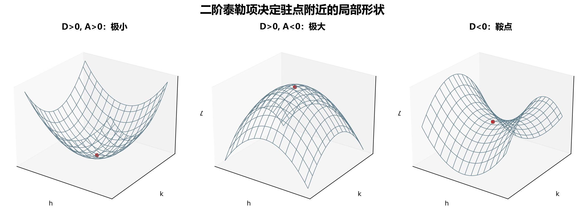

## 10. 二元函数的泰勒公式：用多项式描述局部形状

### 与上一小节关系

极值充分条件依赖函数在驻点附近的局部形状。泰勒公式正是用多项式刻画局部形状的工具；一阶泰勒对应全微分，二阶泰勒对应极值判别。

### 学习目标

- 会写二元函数在一点附近的泰勒展开。
- 会使用一阶、二阶、三阶展开做近似。
- 理解二阶项为什么决定驻点处的极大、极小或鞍点。

### 正文内容

#### 10.1 二元泰勒公式

设

$$
h=x-x_0,\qquad k=y-y_0.
$$

若 $f(x,y)$ 在 $(x_0,y_0)$ 附近有直到 $(n+1)$ 阶连续偏导数，则

$$
f(x_0+h,y_0+k)
=f(x_0,y_0)
+\left(h\frac{\partial}{\partial x}+k\frac{\partial}{\partial y}\right)f(x_0,y_0)
$$

$$
+\frac1{2!}
\left(h\frac{\partial}{\partial x}+k\frac{\partial}{\partial y}\right)^2f(x_0,y_0)
+\cdots
$$

$$
+\frac1{n!}
\left(h\frac{\partial}{\partial x}+k\frac{\partial}{\partial y}\right)^n f(x_0,y_0)
+R_n.
$$

拉格朗日余项为

$$
R_n=
\frac1{(n+1)!}
\left(h\frac{\partial}{\partial x}+k\frac{\partial}{\partial y}\right)^{n+1}
f(x_0+\theta h,y_0+\theta k),
\qquad 0<\theta<1.
$$

其中

$$
\left(h\frac{\partial}{\partial x}+k\frac{\partial}{\partial y}\right)f
=hf_x+kf_y,
$$

$$
\left(h\frac{\partial}{\partial x}+k\frac{\partial}{\partial y}\right)^2f
=h^2f_{xx}+2hkf_{xy}+k^2f_{yy}.
$$

大白话说：一元泰勒是沿数轴展开；二元泰勒是从点 $(x_0,y_0)$ 沿向量 $(h,k)$ 展开。

#### 10.2 常用二阶形式

最常用的是二阶展开：

$$
f(x_0+h,y_0+k)
\approx f(x_0,y_0)+f_xh+f_yk
+\frac12\left(f_{xx}h^2+2f_{xy}hk+f_{yy}k^2\right),
$$

所有偏导数都在 $(x_0,y_0)$ 处取值。

一阶部分就是全微分；二阶部分描述曲面的弯曲。

#### 10.3 例题：$\ln(1+x+y)$ 的三阶展开

求 $f(x,y)=\ln(1+x+y)$ 在 $(0,0)$ 的三阶泰勒公式。

因为

$$
f(0,0)=0,
$$

一阶：

$$
\left(h\frac{\partial}{\partial x}+k\frac{\partial}{\partial y}\right)f(0,0)=h+k.
$$

二阶：

$$
\left(h\frac{\partial}{\partial x}+k\frac{\partial}{\partial y}\right)^2f(0,0)=-(h+k)^2.
$$

三阶：

$$
\left(h\frac{\partial}{\partial x}+k\frac{\partial}{\partial y}\right)^3f(0,0)=2(h+k)^3.
$$

令 $h=x,k=y$，得

$$
\ln(1+x+y)
=x+y-\frac12(x+y)^2+\frac13(x+y)^3+R_3.
$$

其中

$$
R_3=-\frac14\frac{(x+y)^4}{(1+\theta x+\theta y)^4},
\qquad 0<\theta<1.
$$

#### 10.4 用泰勒理解极值充分条件

在驻点处，

$$
f_x(x_0,y_0)=0,\qquad f_y(x_0,y_0)=0.
$$

所以泰勒展开的一阶项消失，函数增量主要由二阶项决定：

$$
\Delta f
\approx
\frac12(Ah^2+2Bhk+Ck^2),
$$

其中

$$
A=f_{xx}(x_0,y_0),\quad B=f_{xy}(x_0,y_0),\quad C=f_{yy}(x_0,y_0).
$$

如果这个二次表达式在所有非零小方向 $(h,k)$ 上都为正，就极小；都为负，就极大；有的方向正、有的方向负，就没有极值。

这正对应第 9 节的判别式：

$$
D=AC-B^2.
$$

- $D>0,A>0$：二次项总为正，极小。
- $D>0,A<0$：二次项总为负，极大。
- $D<0$：不同方向异号，无极值。
- $D=0$：二阶项不够判断，需要看更高阶或直接讨论。

下图把三种二阶项的局部形状放在一起：碗状对应极小，倒碗状对应极大，马鞍状对应无极值。

#### 10.5 拉格朗日中值公式与常数判别

当 $n=0$ 时，二元泰勒公式给出二元函数的拉格朗日中值公式：

$$
f(x_0+h,y_0+k)
=f(x_0,y_0)+h f_x(x_0+\theta h,y_0+\theta k)
+k f_y(x_0+\theta h,y_0+\theta k).
$$

因此，如果在某一区域内

$$
f_x\equiv0,\qquad f_y\equiv0,
$$

则函数在该区域内为常数。

#### 10.6 易错点

- 展开点一定要明确。$h=x-x_0,k=y-y_0$，不要把 $h,k$ 当成 $x,y$ 本身。
- 二阶混合项是 $2hkf_{xy}$，前面还有整体系数 $\frac12$。
- 泰勒公式需要连续偏导条件；阶数越高，需要的连续偏导阶数越高。
- 余项里的偏导数不是在 $(x_0,y_0)$ 取值，而是在 $(x_0+\theta h,y_0+\theta k)$ 取值。

证明处理：二元泰勒公式保留证明主线：令 $\Phi(t)=f(x_0+ht,y_0+kt)$，把问题转成一元泰勒公式；极值充分条件证明压缩为二次项符号分析。

