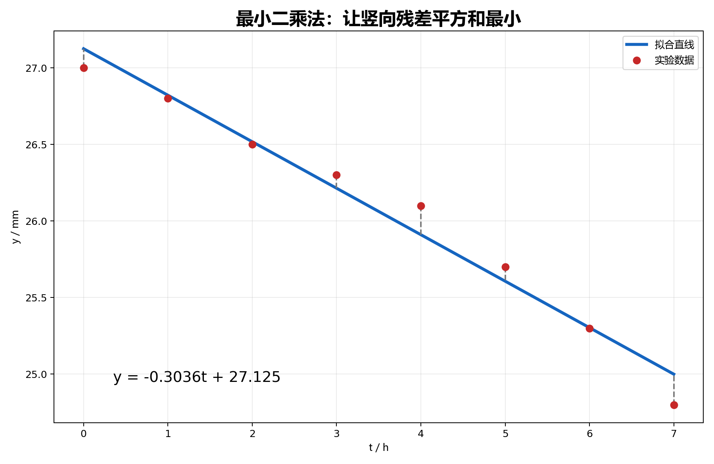

## 11. 最小二乘法：用极值思想拟合经验公式

### 与上一小节关系

前面用极值方法求最优尺寸、最优体积。本小节把极值思想用于实验数据：选择参数，使误差平方和最小。

### 学习目标

- 理解最小二乘法为什么用“偏差平方和”。
- 会建立直线拟合的正规方程。
- 会把指数型经验公式转化为线性拟合。

### 正文内容

#### 11.1 为什么不用偏差和

给定实验数据

$$
(t_i,y_i),
$$

想用经验公式

$$
y=f(t)
$$

描述它们。若选直线

$$
f(t)=at+b,
$$

每个数据点的偏差为

$$
y_i-(at_i+b).
$$

不能简单让偏差和最小，因为正负偏差会抵消。取绝对值虽然自然，但不便于求导。于是采用平方和：

$$
M=\sum_i [y_i-(at_i+b)]^2.
$$

选择 $a,b$ 使 $M$ 最小，这就是最小二乘法。

#### 11.2 直线拟合的正规方程

令

$$
M(a,b)=\sum_{i=1}^{n}[y_i-(at_i+b)]^2.
$$

极值条件是

$$
M_a=0,\qquad M_b=0.
$$

计算得到正规方程：

$$
a\sum_{i=1}^{n}t_i^2+b\sum_{i=1}^{n}t_i
=\sum_{i=1}^{n}t_i y_i,
$$

$$
a\sum_{i=1}^{n}t_i+nb
=\sum_{i=1}^{n}y_i.
$$

解这个二元一次方程组，就得到拟合直线。

#### 11.3 例题：刀具磨损速度

源文数据为：

| $t_i/\mathrm h$ | 0 | 1 | 2 | 3 | 4 | 5 | 6 | 7 |
|---:|---:|---:|---:|---:|---:|---:|---:|---:|
| $y_i/\mathrm{mm}$ | 27.0 | 26.8 | 26.5 | 26.3 | 26.1 | 25.7 | 25.3 | 24.8 |

散点大致接近直线，设

$$
y=at+b.
$$

源文计算：

$$
\sum t_i=28,\qquad \sum t_i^2=140,\qquad \sum y_i=208.5,\qquad \sum t_i y_i=717.0.
$$

正规方程为

$$
\begin{cases}
140a+28b=717,\\
28a+8b=208.5.
\end{cases}
$$

解得

$$
a=-0.3036,\qquad b=27.125.
$$

经验公式为

$$
y=-0.3036t+27.125.
$$

下图中红点是实验数据，蓝线是最小二乘拟合直线，灰色虚线表示各数据点到拟合直线的竖向残差。

均方误差用

$$
\sqrt M
$$

衡量拟合好坏。源文中 $M=0.108165$，所以

$$
\sqrt M\approx0.329.
$$

#### 11.4 指数型经验公式

有些数据不适合直接用直线，但可以变形为直线。

若理论或散点图提示

$$
y=ke^{m\tau},
$$

两边取常用对数：

$$
\lg y=(m\lg e)\tau+\lg k.
$$

令

$$
a=m\lg e,\qquad b=\lg k,
$$

就变成

$$
\lg y=a\tau+b.
$$

于是对数据 $(\tau_i,\lg y_i)$ 做直线最小二乘拟合。

源文例题计算得到

$$
a=-0.045,\qquad b=1.8964,
$$

所以

$$
m=-0.1036,\qquad k=78.78.
$$

经验公式为

$$
y=78.78e^{-0.1036\tau}.
$$

#### 11.5 易错点

- 最小二乘法前先选模型。模型选错，计算再准也只是错模型的最佳参数。
- 平方和最小不是偏差和最小；不要让正负误差抵消。
- 对指数模型取对数后，拟合的是 $\lg y$ 的误差，不是原始 $y$ 的误差。
- 正规方程里的求和下标要一致，数据个数 $n$ 要写对。

证明处理：正规方程推导完整保留，因为它直接来自多元函数极值条件，是本章应用的收束点。

