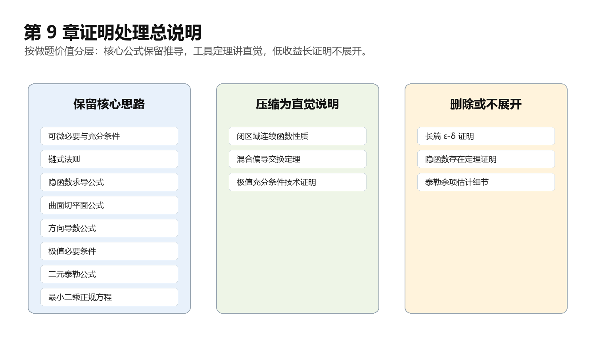

## 本章证明处理总说明

- 保留核心思路：可微的必要条件与充分条件、链式法则、隐函数求导公式、曲面切平面公式、方向导数公式、极值必要条件、二元泰勒公式、最小二乘正规方程。
- 压缩为直觉说明：闭区域连续函数性质、混合偏导交换定理、极值充分条件的完整技术证明。
- 删除或不展开：对做题帮助很小的长篇 $\varepsilon$-$\delta$ 证明、隐函数存在定理证明、泰勒余项估计的细节证明。

