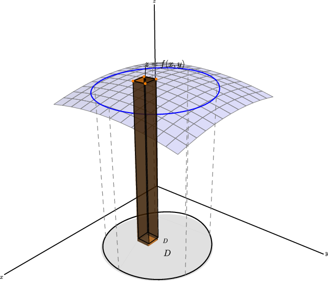
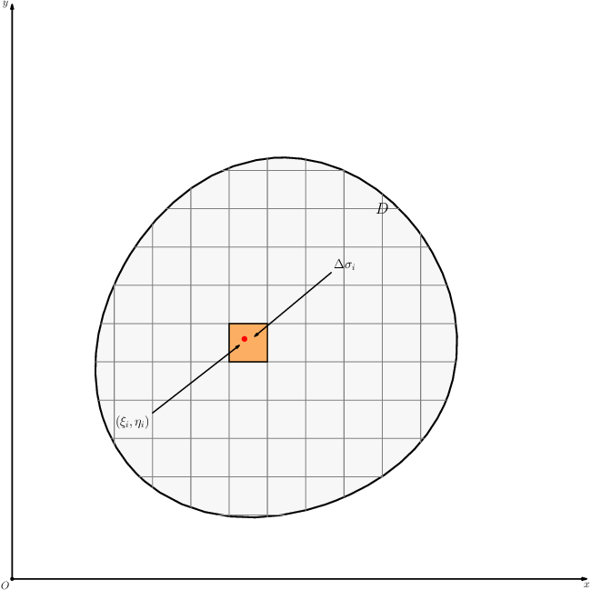
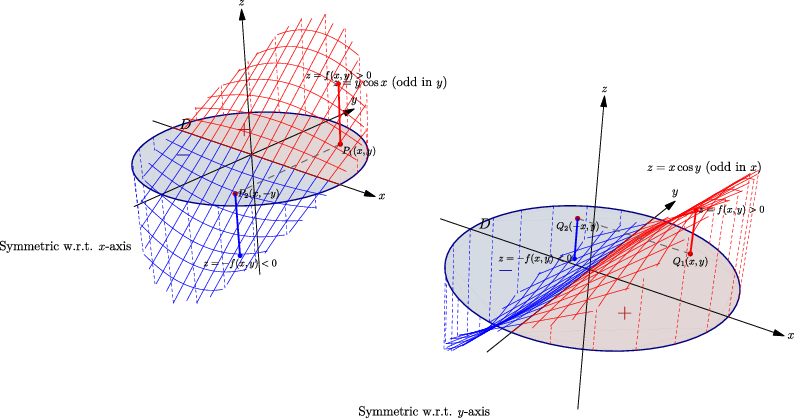

## 1. 二重积分的定义：把"切小块求和"从一维推广到二维

### 与上一小节关系

第九章讲完了多元函数怎么求导、梯度怎么用。这一章掉转方向——不求变化率了，而是求**累加总量**。一元积分把线段切成小段再累加，二重积分把这个思想原封不动搬到平面区域上：把一块平面切成许多小片，每片上的贡献加起来。

### 学习目标

- 理解二重积分的定义不是死记符号，而是"切小块 → 近似 → 求和 → 取极限"。
- 能用几何意义（曲顶柱体体积）和物理意义（薄片质量）解释二重积分。
- 掌握基本性质，能用对称性和估值不等式快速处理题目。

---

### 1.1 从一元积分到二重积分——动机

一元定积分 $\int_a^b f(x)\,dx$ 做的事：把 $[a,b]$ 切成小段，每段上"高度 $f(x)$ × 宽度 $dx$"近似小矩形面积，加起来。

那如果是**平面区域** $D$ 上定义了一个函数 $f(x,y)$，怎么累加？

> 把 $D$ 切成许多小片 $\Delta \sigma_i$，每片上函数值近似不变，贡献就是 $f(\xi_i,\eta_i)\,\Delta \sigma_i$。全部加起来，取极限，就是二重积分。

几何直觉：$f(x,y) \ge 0$ 时，$z = f(x,y)$ 是 $D$ 上方一张曲面。曲面和 $D$ 之间的立体体积怎么求？

> 同一个 $\Delta\sigma_i$，俯视是平面上的"**小片**"，侧视是立体中的"**细柱**"——底是 $\Delta\sigma_i$，顶碰到曲面 $z=f(x,y)$，高约 $f(\xi_i,\eta_i)$。每个细柱体积 ≈ 底面积 × 高 = $f(\xi_i,\eta_i)\Delta\sigma_i$，全部加起来取极限就是二重积分。

小片和细柱说的是同一个东西，只是从二维底面看和从三维空间看，称呼不同而已。

---

### 1.2 定义

设 $f(x,y)$ 定义在有界闭区域 $D$ 上。将 $D$ 任意分割成 $n$ 个小区域 $\Delta \sigma_1, \Delta \sigma_2, \ldots, \Delta \sigma_n$（符号同时表示小区域和它的面积）。在每个小区域中任取一点 $(\xi_i, \eta_i)$，作积分和：

$$
\sum_{i=1}^n f(\xi_i, \eta_i)\,\Delta \sigma_i.
$$

令所有小区域的**最大直径** $\lambda \to 0$（直径 = 区域中任意两点间最大距离），若极限存在且与分割方式、取点方式都无关，则称此极限为 $f$ 在 $D$ 上的**二重积分**：

$$
\boxed{
\iint_D f(x,y)\,d\sigma = \lim_{\lambda \to 0} \sum_{i=1}^n f(\xi_i, \eta_i)\,\Delta \sigma_i
}
$$

直角坐标下，面积元素通常写作 $d\sigma = dx\,dy$，积分也写成 $\iint_D f(x,y)\,dx\,dy$。

**关键条件**：若 $f(x,y)$ 在有界闭区域 $D$ 上**连续**，则二重积分一定存在。考试题默认满足此条件。

---

### 1.3 两个最核心的物理/几何意义

**意义一：曲顶柱体体积。** 若 $f(x,y) \ge 0$，底为 $D$，顶为 $z = f(x,y)$，则体积：

$$
V = \iint_D f(x,y)\,d\sigma.
$$

**意义二：平面薄片质量。** 若薄片占据区域 $D$，面密度为 $\mu(x,y)$，则质量：

$$
m = \iint_D \mu(x,y)\,d\sigma.
$$

这两个意义本质上一样：都是"局部密度 × 小面积"的累加。二重积分不限于体积——它表示一切"在区域上按位置加权累加"的量。

---

### 1.4 基本性质

只要积分存在，以下性质成立。

| 性质 | 公式 | 大白话 |
|:---:|------|--------|
| 线性 | $\iint_D (\alpha f + \beta g) = \alpha\iint_D f + \beta\iint_D g$ | 和的积分 = 积分的和 |
| 区域可加性 | 若 $D = D_1 \cup D_2$（无重叠），则 $\iint_D f = \iint_{D_1} f + \iint_{D_2} f$ | 拆区域分别积 |
| 面积 | $\iint_D 1\,d\sigma = A(D)$ | $f=1$ 时积分就是区域面积 |
| 单调性 | 若 $f \le g$，则 $\iint_D f \le \iint_D g$ | 函数大，积分大 |
| 绝对值 | $\left\lvert \iint_D f\,d\sigma \right\rvert \le \iint_D \lvert f\rvert\,d\sigma$ | 先积分再绝对值 ≤ 先绝对值再积分 |
| 估值 | $mA \le \iint_D f \le MA$（$m, M$ 为 $f$ 在 $D$ 上的最小、最大值） | 积分夹在最小×面积和最大×面积之间 |
| 中值定理 | 若 $f$ 连续，则存在 $(\xi,\eta) \in D$ 使 $\iint_D f = f(\xi,\eta) \cdot A(D)$ | 积分 = 某点函数值 × 面积 |

---

### 1.5 对称性：考场上最省时间的工具

**一定要先看对称性，再决定要不要硬算。**

| 条件 | 结论 |
|------|------|
| $D$ 关于 $y$ 轴对称，$f$ 关于 $x$ 是**奇**函数 | $\iint_D f = 0$ |
| $D$ 关于 $x$ 轴对称，$f$ 关于 $y$ 是**奇**函数 | $\iint_D f = 0$ |
| $D$ 关于两坐标轴都对称，$f$ 关于 $x$ 和 $y$ 都是**偶**函数 | $\iint_D f = 4\iint_{D_1} f$，$D_1$ 为第一象限部分 |

**什么时候用？** 被积函数里有 $x$、$y$、$\sin x$、$\cos y$ 等奇偶明显的项，区域又是圆、矩形之类对称区域——先拆项，奇函数项直接归零。

---

### 1.6 例题

**例 1**：估计

$$
I = \iint_D (x + y + 10)\,d\sigma,
$$

其中 $D$ 是圆盘 $(x-2)^2 + (y-1)^2 \le 2$。

圆心 $(2,1)$，半径 $\sqrt 2$，面积 $A(D) = 2\pi$。

$f(x,y) = x + y + 10$。在圆盘上，$x+y$ 的中心值为 $2+1=3$，沿方向 $(1,1)$ 的最大变化量为半径 × 方向长度 $= \sqrt 2 \cdot \sqrt 2 = 2$。因此：

$$
11 \le x+y+10 \le 15.
$$

由估值不等式：

$$
\boxed{22\pi \le I \le 30\pi}.
$$

---

**例 2**：计算

$$
\iint_D (2 + y\cos x + xy\sin y)\,d\sigma,
$$

其中 $D$ 是单位圆盘 $x^2 + y^2 \le 1$。

先看对称性。单位圆盘关于 $x$ 轴、$y$ 轴都对称。

- $\iint_D 2\,d\sigma = 2 \times \pi \cdot 1^2 = 2\pi.$
- $y\cos x$：关于 $y$ 是奇函数（$y \to -y$ 取反号），区域关于 $x$ 轴对称 → 积分为 $0$。
- $xy\sin y$：关于 $x$ 是奇函数（$x \to -x$ 取反号），区域关于 $y$ 轴对称 → 积分为 $0$。

因此：

$$
\boxed{\iint_D (2 + y\cos x + xy\sin y)\,d\sigma = 2\pi}.
$$

不画积分限，不算二次积分，纯靠对称性直接出答案。

---

### 1.7 易错点

1. **二重积分的值不一定是体积。** $f \ge 0$ 时才对应曲顶柱体体积。$f$ 有正有负时，积分是"带符号的净体积"。
2. **$d\sigma$ 不是装饰。** 在后面极坐标换元时，它要从 $dx\,dy$ 变成 $\rho\,d\rho\,d\theta$，漏了就会全错。
3. **对称性要"区域 + 函数"同时满足。** 区域对称但函数不奇不偶，不能消。
4. **估值题要找整个区域上的最大值和最小值**，不是只看中心点或边界。

---

### 1.8 证明思路

二重积分定义的核心链条：

$$
\text{分割} \to \text{取点} \to \text{作积分和} \to \text{取极限}.
$$

连续函数在有界闭区域上**一致连续**，保证了无论怎么分割、怎么取点，极限都收敛到同一个值。严格 $\varepsilon$-$\delta$ 证明对做题帮助不大，理解这个逻辑链条即可。

中值定理：积分平均值 $\frac{1}{A}\iint_D f$ 介于 $f$ 在 $D$ 上的最小值和最大值之间，由连续函数的介值定理，存在某点恰好取到这个平均值。

---
