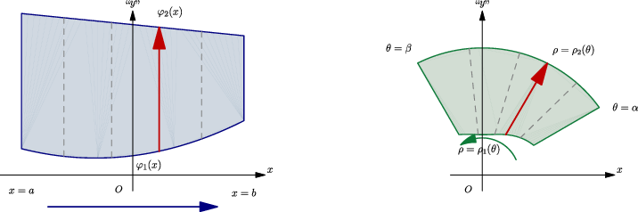
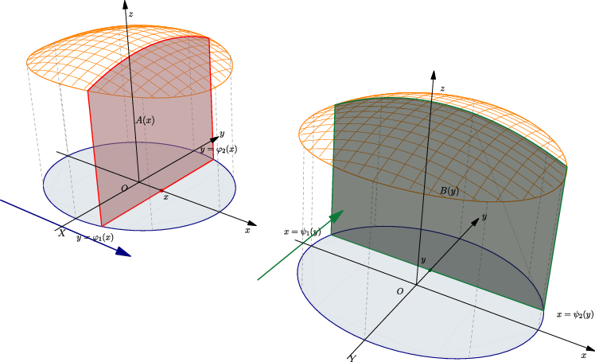
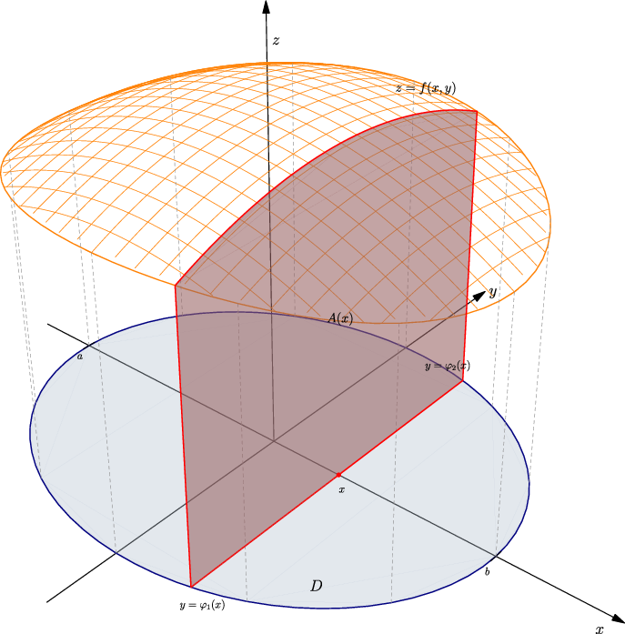
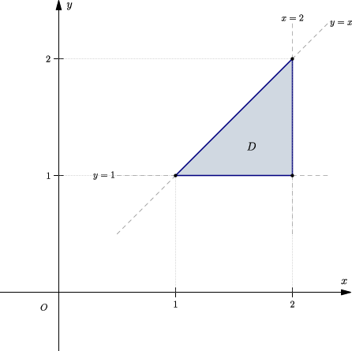
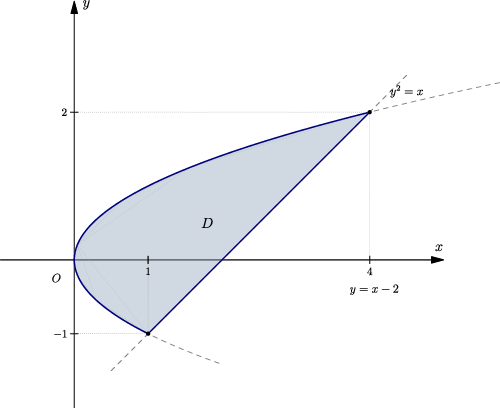
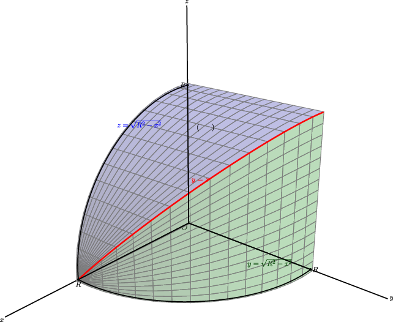

## 2. 直角坐标计算二重积分：先扫一条线，再扫一个面

### 与上一小节关系

上一节说了二重积分"是什么"——切小块求和。这一节解决"怎么算"——把平面区域上的累加，化成两次一元定积分，一层套一层。

### 学习目标

- 会把二重积分写成二次积分（也叫累次积分）。
- 会判断 $X$ 型、$Y$ 型区域，必要时拆区域。
- 会交换积分次序——换序前必须先还原区域，绝不是机械交换积分号。

---

### 2.1 核心思想：把二重积分拆成两层一元积分

二重积分的计算本质是“用一根线扫过一个面”，从而把一个二维的积分拆成两层一元积分。

直角坐标系下的扫描采用**平移扫描**的方式，扫描线是笔直的直线，沿着坐标轴平行移动来覆盖整个区域。相比之下，极坐标系则采用**旋转扫描**的方式，扫描线是射线，绕着原点旋转划过整个区域。

---

### 2.2 公式

根据平移扫描的方向不同，直角坐标下的积分区域分为 $X$ 型区域（竖线扫）与 $Y$ 型区域（横线扫）：

若区域 $D$ 可以写成“竖线扫”的形式（称 $X$ 型区域）：

$$
D = \{(x,y) \mid a \le x \le b,\ \varphi_1(x) \le y \le \varphi_2(x)\},
$$

则：

$$
\boxed{
\iint_D f(x,y)\,dx\,dy
= \int_a^b \left[ \int_{\varphi_1(x)}^{\varphi_2(x)} f(x,y)\,dy \right] dx
}
$$

若区域用"横线扫"更方便（称 $Y$ 型区域）：

$$
D = \{(x,y) \mid c \le y \le d,\ \psi_1(y) \le x \le \psi_2(y)\},
$$

则：

$$
\boxed{
\iint_D f(x,y)\,dx\,dy
= \int_c^d \left[ \int_{\psi_1(y)}^{\psi_2(y)} f(x,y)\,dx \right] dy
}
$$

**记忆口诀**：内层变量的积分限可以含外层变量，外层限必须是常数。内层限不能含内层变量自己。

---

### 2.3 几何解释：从三维空间切片看累次积分

二重积分的几何意义是求曲顶柱体的体积。如果我们把这个曲顶柱体看作一块面包，求体积的过程就是把面包切成无数个薄片，再把它们的体积加在一起。

结合图形，我们可以从三维空间的角度这样理解直角坐标的计算过程：

1. **第一步：固定 $x$，沿 $y$ 方向积分 → 截面面积**
   用平面 $x = \text{常数}$ 去截柱体，得到一个曲边梯形截面。截面下边界 $y \in [\varphi_1(x), \varphi_2(x)]$，高度 $z = f(x,y)$，面积为：
   $$
   A(x) = \int_{\varphi_1(x)}^{\varphi_2(x)} f(x,y)\,dy \qquad (\text{此时 } x \text{ 视为常数})
   $$

2. **第二步：对 $x$ 积分 → 体积**
   让 $x$ 从 $a$ 扫到 $b$，将所有薄片 $A(x)dx$ 累加：
   $$
   V = \int_a^b A(x)\,dx = \int_a^b \left[ \int_{\varphi_1(x)}^{\varphi_2(x)} f(x,y)\,dy \right] dx
   $$

这本质上就是"平行截面面积已知求体积"——二重积分化二次积分，不过是先求截面面积，再沿轴向累加。

---

### 2.4 操作流程（七步，别跳）

1. **画图**，标出所有边界曲线。
2. **求交点**，确定外层变量的范围。
3. **判断扫描方向**：竖线扫简单还是横线扫简单？
4. 竖线扫：写 $a \le x \le b$，再写下边界 $\le y \le$ 上边界。
5. 横线扫：写 $c \le y \le d$，再写左边界 $\le x \le$ 右边界。
6. **如果一条扫描线会穿过多个断开的线段**，拆区域！
7. 最后算积分。

**换序也一样**：不能把 $\int dx \int dy$ 直接改成 $\int dy \int dx$ 就完事。必须先还原区域图，再按新方向重新写边界。

---

### 2.5 例题

**例 1**：计算

$$
\iint_D xy\,dx\,dy,
$$

其中 $D$ 由直线 $y=1$、$x=2$、$y=x$ 围成。

**竖线扫**：$1 \le x \le 2$，$1 \le y \le x$。

$$
\begin{aligned}
\iint_D xy\,dx\,dy
&= \int_1^2 \int_1^x xy\,dy\,dx \
&= \int_1^2 x \cdot \frac{x^2-1}{2}\,dx \
&= \frac{9}{8}.
\end{aligned}
$$

**横线扫**：$1 \le y \le 2$，$y \le x \le 2$。

$$
\iint_D xy\,dx\,dy
= \int_1^2 \int_y^2 xy\,dx\,dy
= \frac{9}{8}.
$$

两种次序结果一样——验证了换序不改积分值。

---

**例 2**：计算

$$
\iint_D xy\,dx\,dy,
$$

其中 $D$ 由抛物线 $y^2 = x$ 与直线 $y = x - 2$ 围成。

求交点：$x = y^2$ 代入 $x = y + 2$，得 $y^2 = y + 2$，即 $y = -1,\ 2$。

**横线扫最简单**：

$$
-1 \le y \le 2,\qquad y^2 \le x \le y + 2.
$$

$$
\begin{aligned}
\iint_D xy\,dx\,dy
&= \int_{-1}^2 \int_{y^2}^{y+2} xy\,dx\,dy \
&= \frac12 \int_{-1}^2 y\left[(y+2)^2 - y^4\right] dy \
&= \frac{45}{8}.
\end{aligned}
$$

如果竖线扫，需要在 $x=1$ 处拆成两块：

$$
D_1: 0 \le x \le 1,\ -\sqrt{x} \le y \le \sqrt{x},
$$
$$
D_2: 1 \le x \le 4,\ x-2 \le y \le \sqrt{x}.
$$

**结论**：选积分次序不是形式问题，选错会让计算量翻倍。

---

**例 3**：两个半径都为 $R$ 的直交圆柱面

$$
x^2 + y^2 = R^2,\qquad x^2 + z^2 = R^2
$$

所围立体的体积（这个立体叫"牟合方盖"，古代中国数学家祖暅就已经会算了）。

利用对称性（关于三个坐标平面都对称），只算第一卦限再乘 $8$。

第一卦限中：$0 \le x \le R$，$0 \le y \le \sqrt{R^2 - x^2}$，顶面 $z = \sqrt{R^2 - x^2}$。

$$
\begin{aligned}
V_1
&= \int_0^R \int_0^{\sqrt{R^2-x^2}} \sqrt{R^2-x^2}\,dy\,dx \
&= \int_0^R (R^2 - x^2)\,dx \
&= \frac{2R^3}{3}.
\end{aligned}
$$

总体积：

$$
\boxed{V = 8V_1 = \frac{16R^3}{3}}.
$$

---

### 2.6 易错点

1. **内层积分限不能含内层变量。** 先对 $y$ 积分时，上下限可以含 $x$，不能含 $y$。
2. **外层范围来自投影**，不是随便从图上取最大最小值。
3. **区域不是 $X$ 型或 $Y$ 型时要拆分。** 硬写一个积分会漏算或重复。
4. **换序必须先画区域。** 只交换 $dx$、$dy$ 位置没有意义。
5. **被积函数有负值时，积分可能为负**——不要用"体积必须为正"强行改符号。

---

### 2.7 证明思路

直角坐标计算公式本质上是把二重积分写成"先沿一条线积，再把所有线的结果累加"。严格证明依赖富比尼定理（Fubini），核心条件是函数连续。做题层面，记住"截面面积法"的几何直觉就足够了。

---
