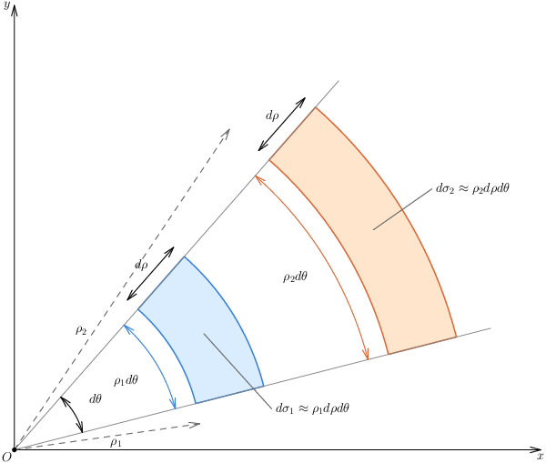
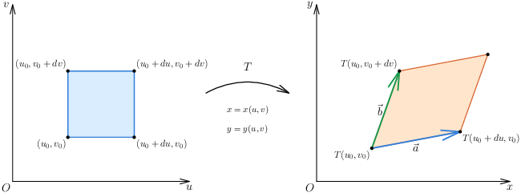
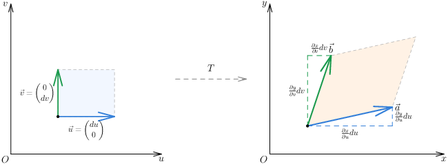
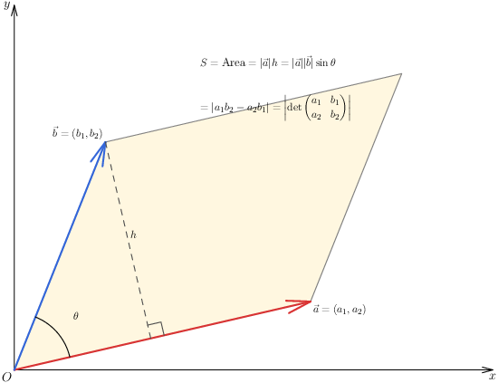
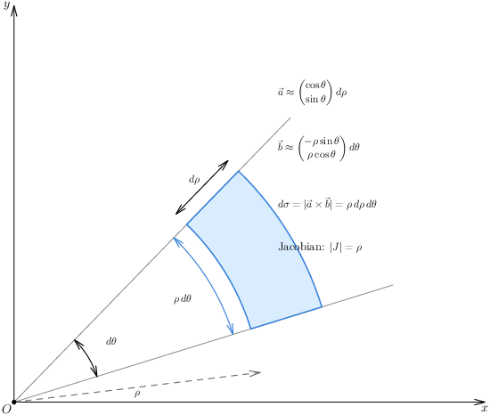
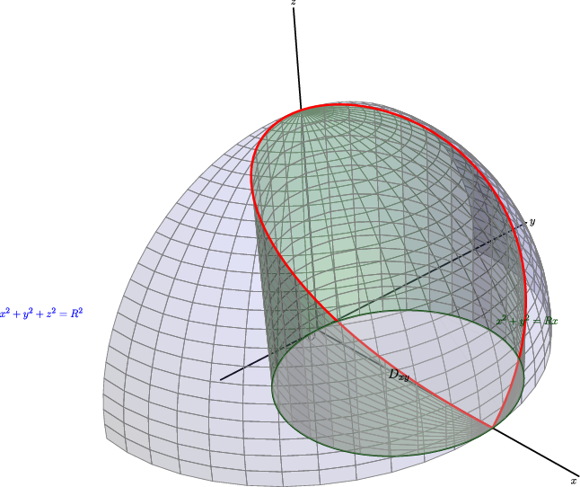

## 3. 极坐标与二重积分换元：让圆形区域回归简单

### 与上一小节关系

上一节用直角坐标扫区域。但遇到圆、圆环、扇形，或者被积函数里有 $x^2+y^2$ 时，直角坐标的边界会带根号，很麻烦。本节用极坐标——把"圆"变成"矩形"——以及更一般的换元法。

### 学习目标

- 记住极坐标面积元素是 $\rho\,d\rho\,d\theta$，不是 $d\rho\,d\theta$。
- 会把圆形、环形、扇形区域写成极坐标积分。
- 理解一般换元公式中雅可比行列式是"面积缩放因子"。
- 会判断什么时候该换元、换什么元。

---

### 3.1 极坐标：为什么专门学它？

直角坐标描述一个圆盘 $x^2+y^2 \le a^2$，边界是 $\pm\sqrt{a^2-x^2}$——内层积分限带根号，积起来痛苦。

但用极坐标 $(x = \rho\cos\theta,\ y = \rho\sin\theta)$，同一个圆盘就是：

$$
0 \le \theta \le 2\pi,\qquad 0 \le \rho \le a.
$$

边界全成了**常数**！这就是极坐标的价值——让"圆形的区域"变得跟矩形一样简单。

---

### 3.2 面积元素：为什么多了一个 $\rho$？

$$
\boxed{d\sigma = \rho\,d\rho\,d\theta}
$$

这是极坐标最容易错的地方。**不是 $d\rho\,d\theta$。**

直觉理解：离原点越远，同样的 $d\rho\,d\theta$ 扫出的实际面积越大。就像地球仪上，同样的经度×纬度格子，在赤道附近面积大，在极地附近面积小。那个 $\rho$ 就是"离原点越远，弧越长"的修正因子。

> **直观几何对比**：
> 如图所示，在同一个极坐标系下，我们取两个具有**相同角增量 $d\theta$** 和**相同径向厚度 $d\rho$** 的微元扇形区域：
> - 靠近原点处的微元，半径为 $\rho_1$，其内侧弧长为 $\rho_1 d\theta$，面积近似为 $d\sigma_1 \approx \rho_1 d\rho d\theta$。
> - 远离原点处的微元，半径为 $\rho_2$（$\rho_2 > \rho_1$），其内侧弧长为 $\rho_2 d\theta$。明显可以看出，由于半径更大，外侧的弧线被拉得更长！因此，即使 $d\rho$ 和 $d\theta$ 完全相同，外侧微元的面积 $d\sigma_2 \approx \rho_2 d\rho d\theta$ 也明显大于内侧微元的面积 $d\sigma_1$。
> 
> 这非常直观地揭示了为什么极坐标面积元素必须包含因子 $\rho$ —— 它是一个**随半径增加而线性变大的修正因子**。如果漏掉了 $\rho$，就相当于错误地认为各处的微元面积都是恒定不变的 $d\rho d\theta$。

---

### 3.3 极坐标下的二重积分公式

$$
\boxed{
\iint_D f(x,y)\,dx\,dy
= \iint_{D'} f(\rho\cos\theta,\ \rho\sin\theta)\,\rho\,d\rho\,d\theta
}
$$

若区域可写成：

$$
D = \{(\rho,\theta) \mid \alpha \le \theta \le \beta,\ \rho_1(\theta) \le \rho \le \rho_2(\theta)\},
$$

则：

$$
\iint_D f\,dx\,dy
= \int_\alpha^\beta \int_{\rho_1(\theta)}^{\rho_2(\theta)}
f(\rho\cos\theta,\ \rho\sin\theta)\,\rho\,d\rho\,d\theta.
$$

**什么时候优先考虑极坐标？**

| 信号 | 示例 |
|------|------|
| 区域是圆盘 | $x^2+y^2 \le a^2$ |
| 区域是圆环 | $a^2 \le x^2+y^2 \le b^2$ |
| 区域是扇形 | $\alpha \le \theta \le \beta$ |
| 被积函数含 $x^2+y^2$ | $e^{-(x^2+y^2)}$、$\sin(x^2+y^2)$ |
| 被积函数含 $\sqrt{x^2+y^2}$ | $\frac{1}{\sqrt{x^2+y^2}}$ |
| 边界用 $\rho = \rho(\theta)$ 写更简单 | 心形线、双纽线 |

---

### 3.4 一般换元法（雅可比行列式）

#### 3.4.0 先回忆一维：你早就熟透了

一元积分换元，你闭着眼都会：

$$
x = g(u) \quad\Longrightarrow\quad \int f(x)\,dx = \int f(g(u)) \cdot \color{red}{g'(u)}\,du
$$

那个 $\color{red}{g'(u)}$ 就是**长度缩放因子**——$u$ 那边变化 $du$，$x$ 这边变化 $g'(u)\,du$。

---

#### 3.4.1 到了二维，问题完全一样

现在你要把 $xy$ 平面的积分换成用 $u,v$ 来算：

$$
\iint f(x,y)\,\color{blue}{dx\,dy}
= \iint f\big(x(u,v), y(u,v)\big) \cdot \color{red}{???}\,\color{blue}{du\,dv}
$$

一维的那个 $\color{red}{g'(u)}$，到了二维变成了什么？

**答案：一个数不够了，因为这里涉及两个方向各自的拉伸和扭曲——需要一个矩阵来统一描述，这个矩阵就是雅可比矩阵，它的行列式就是面积缩放倍数。**

> **几何直观**：
> 变换 $T$ 将 $uv$ 平面上的规则网格映射为 $xy$ 平面上的曲线网格。当区域被切得足够小时，在局部微元尺度下，这一映射表现为将 $du \times dv$ 的小矩形变为了以向量 $\vec{a}$ 和 $\vec{b}$ 为相邻两边的近似平行四边形。

---

#### 3.4.2 几何画面：小矩形怎么变成了平行四边形？

考虑 $uv$ 平面上点 $(u_0,v_0)$ 处一个 $du \times dv$ 的小矩形。

在 $uv$ 平面上，这个矩形由两个边向量张成：

$$
\text{沿 }u\text{ 方向走 }du:\ \begin{pmatrix} du \\ 0 \end{pmatrix},\qquad
\text{沿 }v\text{ 方向走 }dv:\ \begin{pmatrix} 0 \\ dv \end{pmatrix}
$$

这两个向量映射到 $xy$ 平面后，利用全微分的想法做线性近似：

- 沿 $u$ 方向走 $du$，$x$ 变化约 $\dfrac{\partial x}{\partial u}\,du$，$y$ 变化约 $\dfrac{\partial y}{\partial u}\,du$
- 沿 $v$ 方向走 $dv$，$x$ 变化约 $\dfrac{\partial x}{\partial v}\,dv$，$y$ 变化约 $\dfrac{\partial y}{\partial v}\,dv$

所以在 $xy$ 平面上得到两个向量：

$$
\vec{a} = \begin{pmatrix} \frac{\partial x}{\partial u}\,du \\[4pt] \frac{\partial y}{\partial u}\,du \end{pmatrix},\qquad
\vec{b} = \begin{pmatrix} \frac{\partial x}{\partial v}\,dv \\[4pt] \frac{\partial y}{\partial v}\,dv \end{pmatrix}
$$

这两个向量张成一个**平行四边形**——而这正是原来那个 $du \times dv$ 小矩形的「像」。

> **微分线性近似**：
> 利用全微分，我们在 $xy$ 平面上用切线近似代替曲线。当 $uv$ 发生小变化 $(du, 0)$ 和 $(0, dv)$ 时，在 $xy$ 平面上对应的两个边向量可近似表示为偏导数与增量的乘积：$\vec{a} \approx (x_u du, y_u du)$，$\vec{b} \approx (x_v dv, y_v dv)$。这构成了局部平行四边形的底和侧边。

---

#### 3.4.3 平行四边形的面积 = 行列式（线性代数登场）

由线性代数：两个向量 $\vec{a}, \vec{b}$ 张成的平行四边形面积 = 它们构成的行列式的绝对值。

> **线性代数桥梁**：
> 由线性代数可知，由向量 $\vec{a}$ and $\vec{b}$ 张成的平行四边形面积，恰好等于它们所构成的行列式的绝对值，即 $\text{Area} = |a_1 b_2 - a_2 b_1|$。这一代数工具完美搭起了微元几何面积与导数之间的桥梁。

把 $\vec{a}, \vec{b}$ 代入：

$$
\begin{aligned}
\det(\vec{a}, \vec{b})
&= \begin{vmatrix}
x_u\,du & x_v\,dv \\
y_u\,du & y_v\,dv
\end{vmatrix} \\[8pt]
&= x_u\,du \cdot y_v\,dv - x_v\,dv \cdot y_u\,du \\[4pt]
&= \big(x_u y_v - x_v y_u\big)\,du\,dv
\end{aligned}
$$

中间那个 $x_u y_v - x_v y_u$ 写成行列式形式就是雅可比行列式：

$$
J(u,v) = \frac{\partial(x,y)}{\partial(u,v)}
= \begin{vmatrix}
x_u & x_v \\
y_u & y_v
\end{vmatrix}
= x_u y_v - x_v y_u
$$

于是：

$$
\boxed{dx\,dy = |J(u,v)|\,du\,dv}
$$

> **极坐标特例验证**：
> 将极坐标变换 $x=\rho\cos\theta$，$y=\rho\sin\theta$ 视作一般换元的特例，此时的两个偏导数向量 $\vec{a}$（沿径向）和 $\vec{b}$（沿切向）构成的雅可比行列式值为 $\rho$。它们所张成的微元面积为 $d\sigma = \rho d\rho d\theta$，这与 3.2 节用小扇形面积差算出的几何直观完美吻合。

---

#### 3.4.4 完整公式

一维二维对照：

| | 一维 | 二维 |
|---|---|---|
| 换元 | $x = g(u)$ | $(x,y) = T(u,v)$ |
| 小增量变换 | $dx = g'(u)\,du$ | 小矩形 → 平行四边形 |
| 缩放因子 | $\mid g'(u) \mid$ | $\mid J(u,v) \mid$ |
| 本质 | 长度缩放 | **面积缩放** |
| 公式 | $\int f\,dx = \int f \mid g' \mid du$ | $\iint f\,dx\,dy = \iint f \mid J \mid du\,dv$ |

完整写出来：

$$
\boxed{
\iint_D f(x,y)\,dx\,dy
= \iint_{D'} f\big(x(u,v),\,y(u,v)\big) \cdot |J(u,v)|\,du\,dv
}
$$

---

#### 3.4.5 极坐标验证——确认这玩意说得通

极坐标是 $u=\rho,\ v=\theta$，$x = \rho\cos\theta,\ y = \rho\sin\theta$：

$$
J = \begin{vmatrix}
x_\rho & x_\theta \\
y_\rho & y_\theta
\end{vmatrix}
= \begin{vmatrix}
\cos\theta & -\rho\sin\theta \\
\sin\theta & \rho\cos\theta
\end{vmatrix}
= \rho\cos^2\theta + \rho\sin^2\theta = \rho
$$

$|J| = \rho$，和 3.2 的结论一模一样。不是巧合——**3.2 讲的 $\rho$ 修正因子本来就是一般换元公式在极坐标下的特例。**

---

### 3.5 一般换元的选元策略

**核心原则：好的变换让"区域边界"或"被积函数"至少一个变简单——最好两个都变简单。**

常见套路：

| 题中出现 | 尝试令 |
|----------|--------|
| 反复出现 $x+y$ 和 $y-x$ | $u = x+y,\ v = y-x$ |
| 反复出现 $xy$ 和 $y/x$ | $u = xy,\ v = y/x$ |
| 椭圆边界 $\frac{x^2}{a^2}+\frac{y^2}{b^2}=1$ | $x = a\rho\cos\theta,\ y = b\rho\sin\theta$（广义极坐标） |
| 边界是双曲线或直线族 | 把边界方程直接设为新变量 |

---

### 3.6 操作流程

**极坐标**：

1. $x = \rho\cos\theta,\ y = \rho\sin\theta$
2. 改写被积函数
3. 改写区域边界为 $\rho,\theta$ 表示
4. 确定 $\theta$ 范围（扫过多大角度），再确定 $\rho$ 范围（从哪条线进、哪条线出）
5. **面积元素必须是 $\rho\,d\rho\,d\theta$**

**一般换元**：

1. 从题目中重复出现的表达式选 $u,v$
2. 反解 $x = x(u,v),\ y = y(u,v)$
3. 把原区域边界翻译成 $uv$ 平面的边界
4. 算 $J = \frac{\partial(x,y)}{\partial(u,v)}$，取绝对值
5. 全换：被积函数、面积元素、积分区域

---

### 3.7 例题

**例 1**：计算

$$
\iint_D e^{-(x^2+y^2)}\,dx\,dy,
$$

其中 $D$ 是圆盘 $x^2+y^2 \le a^2$。

极坐标：$0 \le \rho \le a,\ 0 \le \theta \le 2\pi$。

$$
\begin{aligned}
\iint_D e^{-(x^2+y^2)}\,dx\,dy
&= \int_0^{2\pi} \int_0^a e^{-\rho^2} \rho\,d\rho\,d\theta \
&= 2\pi \cdot \frac{1 - e^{-a^2}}{2} \
&= \boxed{\pi\left(1 - e^{-a^2}\right)}.
\end{aligned}
$$

这个积分在直角坐标下基本算不出来（$e^{-x^2}$ 没有初等原函数），但极坐标下两行搞定——这就是选对坐标系的威力。

---

**例 2**：求球体 $x^2+y^2+z^2 \le 4a^2$ 被圆柱面 $x^2+y^2 = 2ax$ 截出的、在圆柱面内的部分体积。

圆柱面极坐标方程为 $\rho = 2a\cos\theta$。利用对称性（关于 $xOy$ 平面对称、关于 $xOz$ 平面对称）：

$$
0 \le \theta \le \frac{\pi}{2},\qquad 0 \le \rho \le 2a\cos\theta,
$$

再乘 $4$。上半球顶面：$z = \sqrt{4a^2 - \rho^2}$。

$$
\begin{aligned}
V &= 4\int_0^{\pi/2} \int_0^{2a\cos\theta}
\sqrt{4a^2 - \rho^2}\,\rho\,d\rho\,d\theta \
&= \frac{32a^3}{3} \int_0^{\pi/2} (1 - \sin^3\theta)\,d\theta \
&= \boxed{\frac{16\pi a^3}{3} - \frac{64a^3}{9}}.
\end{aligned}
$$

---

**例 3**：计算

$$
\iint_D e^{\frac{y-x}{x+y}}\,dx\,dy,
$$

其中 $D$ 由坐标轴和 $x+y=2$ 围成。

题中反复出现 $y-x$ 和 $x+y$。令：

$$
u = y - x,\qquad v = x + y.
$$

反解：$x = \frac{v-u}{2},\ y = \frac{v+u}{2}$。

$$
J = \begin{vmatrix}
-\frac12 & \frac12 \[2pt]
\frac12 & \frac12
\end{vmatrix}
= -\frac12,
\qquad |J| = \frac12.
$$

原区域边界翻译：$x=0 \Rightarrow v=u$，$y=0 \Rightarrow v=-u$，$x+y=2 \Rightarrow v=2$。

所以新区域：$0 \le v \le 2,\ -v \le u \le v$。

$$
\begin{aligned}
\iint_D e^{\frac{y-x}{x+y}}\,dx\,dy
&= \frac12 \int_0^2 \int_{-v}^v e^{u/v}\,du\,dv \
&= \frac12 \int_0^2 v(e - e^{-1})\,dv \
&= \boxed{e - e^{-1}}.
\end{aligned}
$$

---

**例 4**：计算椭圆 $\frac{x^2}{a^2} + \frac{y^2}{b^2} \le 1$ 上的积分

$$
\iint_D \sqrt{1 - \frac{x^2}{a^2} - \frac{y^2}{b^2}}\,dx\,dy.
$$

作**广义极坐标**：$x = a\rho\cos\theta,\ y = b\rho\sin\theta$。

$$
J = \begin{vmatrix}
a\cos\theta & -a\rho\sin\theta \
b\sin\theta & b\rho\cos\theta
\end{vmatrix}
= ab\rho.
$$

区域变为：$0 \le \rho \le 1,\ 0 \le \theta \le 2\pi$。

$$
\begin{aligned}
\iint_D \sqrt{1 - \frac{x^2}{a^2} - \frac{y^2}{b^2}}\,dx\,dy
&= ab \int_0^{2\pi} \int_0^1 \sqrt{1-\rho^2}\,\rho\,d\rho\,d\theta \
&= \boxed{\frac{2\pi ab}{3}}.
\end{aligned}
$$

---

### 3.8 易错点

1. **极坐标必须乘 $\rho$。** 这是最高频错误。不乘 $\rho$，答案量纲不对。
2. **$\theta$ 范围不要重复扫。** 比如整个圆盘用 $0 \le \theta \le 2\pi$，不要写成 $0 \le \theta \le 4\pi$。
3. **雅可比要取绝对值** $|J|$，不能直接用 $J$（$J$ 可能为负）。
4. **极点处 $\rho=0$，雅可比为 $0$**——这不影响积分公式，它是一个点，体积为零。
5. **极坐标下积分次序通常先 $\rho$ 后 $\theta$**（因为 $\rho$ 的边界往往依赖 $\theta$），不要盲目照搬直角坐标的习惯。

---

### 3.9 证明思路

极坐标面积元素：小扇形面积 = $\frac12(\rho+d\rho)^2 d\theta - \frac12\rho^2 d\theta \approx \rho\,d\rho\,d\theta$（略去高阶无穷小 $d\rho^2$）。

一般换元：$uv$ 平面上的小矩形变到 $xy$ 平面后近似为平行四边形，其面积等于 $|J|\,du\,dv$。$J$ 的两个列向量分别是 $\left(\frac{\partial x}{\partial u},\frac{\partial y}{\partial u}\right)du$ 和 $\left(\frac{\partial x}{\partial v},\frac{\partial y}{\partial v}\right)dv$，行列式的绝对值 = 平行四边形面积。

---
