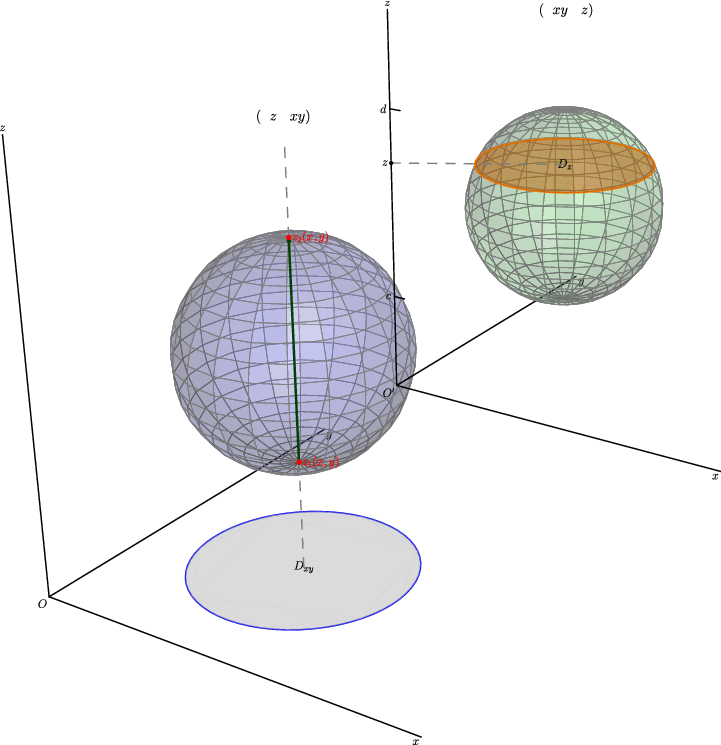
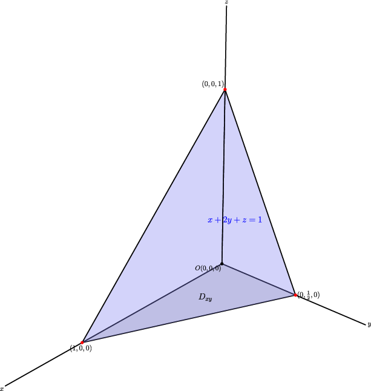

## 4. 三重积分：把"切小块求和"再升一维

### 与上一小节关系

二重积分在平面区域上累加，三重积分把这个思想原封不动推广到**空间区域**——把一块空间体切成许多小体积块，每块上的贡献加起来。思路完全平行，只是多了一个维度。

### 学习目标

- 理解三重积分的定义和物理意义（密度 → 质量）。
- 会用直角坐标把三重积分化为三次积分。
- 会根据空间体的形状选择投影法或截面法。

---

### 4.1 动机：什么时候需要三重积分？

二重积分累加的是平面薄片上的量——每小块贡献 = 面密度 × 小面积。

但实际问题中，物体是**立体**的，密度可能随空间位置变化。比如地球内部密度不均匀，求地球质量——不能只用二重积分，要把整个球体切成小体积块来累加。

> 二重积分 → 平面区域上的累加
> 三重积分 → 空间区域上的累加

---

### 4.2 定义

设 $f(x,y,z)$ 定义在空间有界闭区域 $\Omega$ 上。把 $\Omega$ 切成 $n$ 个小体积块 $\Delta V_1, \Delta V_2, \ldots, \Delta V_n$。每块中取点 $(\xi_i, \eta_i, \zeta_i)$，作积分和：

$$
\sum_{i=1}^n f(\xi_i, \eta_i, \zeta_i)\,\Delta V_i.
$$

令所有小块的最大直径 $\lambda \to 0$，若极限存在且与分割和取点无关，则定义：

$$
\boxed{
\iiint_\Omega f(x,y,z)\,dV
= \lim_{\lambda \to 0} \sum_{i=1}^n f(\xi_i, \eta_i, \zeta_i)\,\Delta V_i
}
$$

直角坐标下 $dV = dx\,dy\,dz$。

**两个核心意义**：

- 若 $f(x,y,z)$ 是**密度**，积分 = **物体质量**：$m = \iiint_\Omega \rho(x,y,z)\,dV.$
- 若 $f \equiv 1$，积分 = **空间体体积**：$V(\Omega) = \iiint_\Omega 1\,dV.$

---

### 4.3 直角坐标计算法

和二重积分类似——把体先投影到平面上，再在平面区域上做二重积分。

#### 方法一：投影法（先 $z$，再 $xy$）

若空间体可写成：

$$
\Omega = \{(x,y,z) \mid (x,y) \in D_{xy},\ z_1(x,y) \le z \le z_2(x,y)\},
$$

则：

$$
\boxed{
\iiint_\Omega f\,dV
= \iint_{D_{xy}} \left[ \int_{z_1(x,y)}^{z_2(x,y)} f(x,y,z)\,dz \right] dx\,dy
}
$$

大白话：先固定 $(x,y)$，沿 $z$ 方向从下表面穿到上表面（一根竖线），再把所有竖线的结果在投影区域 $D_{xy}$ 上累加。

如果 $D_{xy}$ 也是 $X$ 型或 $Y$ 型，就再化成两次积分——总共三次，所以叫**三次积分**。

#### 方法二：截面法（先 $xy$，再 $z$）

若空间体适合按高度切片：

$$
\Omega = \{(x,y,z) \mid c \le z \le d,\ (x,y) \in D_z\},
$$

则：

$$
\boxed{
\iiint_\Omega f\,dV
= \int_c^d \left[ \iint_{D_z} f(x,y,z)\,dx\,dy \right] dz
}
$$

每个高度 $z$ 上切出一个截面 $D_z$，先算截面上二重积分，再把各截面的结果沿 $z$ 方向累加。

---

### 4.4 如何选择投影or截面？

| 情况 | 推荐方法 |
|------|----------|
| 空间体上下表面是明确的 $z=z(x,y)$ 形式 | 投影法（先 $z$） |
| 截面面积 $A(z)$ 容易算（如旋转体、球体） | 截面法（先 $xy$） |
| 被积函数只依赖 $z$ | 截面法 |
| 上下表面形状不同，投影区域简单 | 投影法 |

---

### 4.5 操作流程

1. **画空间体**——至少画出关键边界面和投影区域。
2. **选方法**：投影法还是截面法？
3. 投影法：找"从哪个面进入，从哪个面出去" → 写 $z$ 的范围 → 写投影区域 $D_{xy}$ 的范围。
4. 截面法：找 $z$ 的总范围 → 每个 $z$ 处的截面区域 $D_z$。
5. 如果投影区域 / 截面区域不简单，继续拆分。
6. 检查：若 $f \equiv 1$，结果应该是体积；若 $f$ 是密度，结果应该是质量。

---

### 4.6 例题

**例 1**：计算

$$
\iiint_\Omega x\,dx\,dy\,dz,
$$

其中 $\Omega$ 由三个坐标面和平面 $x + 2y + z = 1$ 围成。

空间体满足：$x \ge 0,\ y \ge 0,\ z \ge 0,\ x+2y+z \le 1.$

**投影到 $xOy$ 面**：令 $z=0$，得 $x+2y = 1$，所以

$$
0 \le x \le 1,\qquad 0 \le y \le \frac{1-x}{2}.
$$

对固定的 $(x,y)$，$z$ 的范围：$0 \le z \le 1 - x - 2y.$

$$
\begin{aligned}
\iiint_\Omega x\,dV
&= \int_0^1 \int_0^{(1-x)/2} \int_0^{1-x-2y} x\,dz\,dy\,dx \
&= \int_0^1 \int_0^{(1-x)/2} x(1-x-2y)\,dy\,dx \
&= \int_0^1 \frac{x(1-x)^2}{4}\,dx \
&= \boxed{\frac{1}{48}}.
\end{aligned}
$$

---

**例 2**：计算椭球 $\frac{x^2}{a^2} + \frac{y^2}{b^2} + \frac{z^2}{c^2} \le 1$ 内的

$$
\iiint_\Omega z^2\,dV.
$$

**用截面法**。固定 $z$，截面为椭圆：

$$
\frac{x^2}{a^2(1 - z^2/c^2)} + \frac{y^2}{b^2(1 - z^2/c^2)} \le 1,
$$

其面积为：

$$
A(z) = \pi ab\left(1 - \frac{z^2}{c^2}\right).
$$

因此：

$$
\begin{aligned}
\iiint_\Omega z^2\,dV
&= \int_{-c}^c z^2 \cdot A(z)\,dz \
&= \pi ab \int_{-c}^c z^2\left(1 - \frac{z^2}{c^2}\right) dz \
&= \boxed{\frac{4\pi abc^3}{15}}.
\end{aligned}
$$

截面法的精髓：当截面面积有简洁表达式时，三重积分退化成一个**一元定积分**。

---

### 4.7 易错点

1. **$dV$ 是体积元素，不是面积元素。** 三重积分不乘 $\rho$（直角坐标下），柱面/球面坐标才加因子。
2. **最内层积分限可以依赖外层变量，不能依赖自己。** 比如 $dz$ 的限可以含 $x,y$，不能含 $z$。
3. **投影区域有时比空间体本身更难画。** 先画俯视图（向坐标面的投影）。
4. **选哪个坐标面投影没有固定答案**——谁简单选谁。
5. **空间体不是"单进单出"时要拆分**（比如中间有空洞，或上下表面不唯一）。

---

### 4.8 证明思路

三重积分定义与二重积分完全平行：切小块 → 近似 → 求和 → 取极限。直角坐标计算法的依据是：先沿一根直线积分（一元），再把所有直线的结果在投影区域上累加（二重积分）。严格证明依赖富比尼定理的三维版本，要求函数连续。

---
