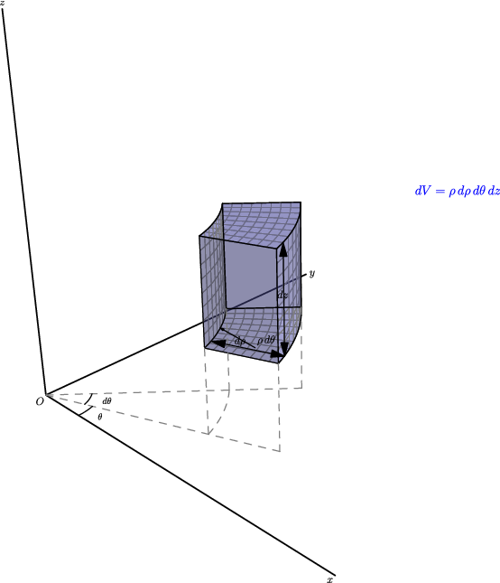
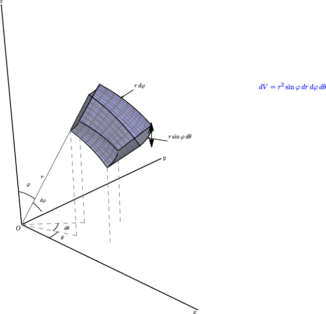
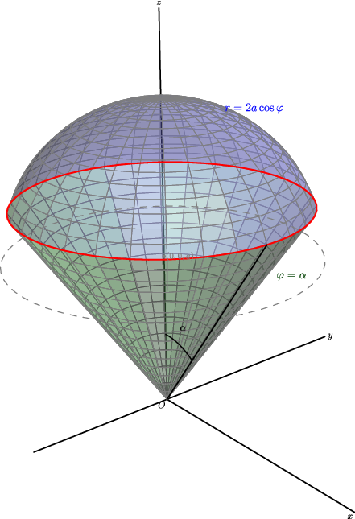

## 5. 柱面坐标与球面坐标：遇到对称体，换把尺子量

### 与上一小节关系

上一节用直角坐标算三重积分。但遇到圆柱、圆锥、球体、旋转抛物面时，直角坐标的边界会变成复杂的根号表达式。本节引入柱面坐标和球面坐标——利用对称性，把曲面边界变成**常数**。

### 学习目标

- 掌握柱面坐标和球面坐标的变换公式。
- 记住两个体积元素：$\rho\,d\rho\,d\theta\,dz$ 和 $r^2\sin\varphi\,dr\,d\varphi\,d\theta$。
- 会根据空间体的对称性选择正确坐标系。

---

### 5.1 柱面坐标：极坐标 + $z$ 轴不变

柱面坐标就是把 $xOy$ 平面换成极坐标，$z$ 保持不变：

$$
\boxed{
x = \rho\cos\theta,\quad y = \rho\sin\theta,\quad z = z
}
$$

体积元素：

$$
\boxed{dV = \rho\,d\rho\,d\theta\,dz}
$$

（就是极坐标面积元素 $\rho\,d\rho\,d\theta$ 再乘高度 $dz$。）

**适合什么题？**

| 信号 | 柱面坐标写法 |
|------|-------------|
| 圆柱面 $x^2+y^2=a^2$ | $\rho = a$ |
| 旋转抛物面 $z = x^2+y^2$ | $z = \rho^2$ |
| 圆锥面 $z = \sqrt{x^2+y^2}$ | $z = \rho$ |
| 被积函数含 $x^2+y^2$ | → $\rho^2$ |
| 空间体绕 $z$ 轴对称 | $\theta$ 范围独立 |



---

### 5.2 球面坐标：换一种"经纬度"定位

球面坐标用三个量定位空间点：

- $r$：到原点的距离（$r \ge 0$）
- $\varphi$：向径与 $z$ 轴正方向的夹角（$0 \le \varphi \le \pi$）——注意！不是仰角，是从 $z$ 轴往下量的
- $\theta$：$xOy$ 平面上的极角（$0 \le \theta \le 2\pi$）

$$
\boxed{
\begin{aligned}
x &= r\sin\varphi\cos\theta \
y &= r\sin\varphi\sin\theta \
z &= r\cos\varphi
\end{aligned}
}
$$

体积元素：

$$
\boxed{dV = r^2\sin\varphi\,dr\,d\varphi\,d\theta}
$$

**直觉理解**：体积元素是球面坐标下的"小曲边六面体"，三条棱长近似为 $dr$（径向）、$r\,d\varphi$（经线方向）、$r\sin\varphi\,d\theta$（纬线方向），三者相乘得 $r^2\sin\varphi\,dr\,d\varphi\,d\theta$。



**适合什么题？**

| 信号 | 球面坐标写法 |
|------|-------------|
| 球面 $x^2+y^2+z^2=a^2$ | $r = a$ |
| 圆锥面（顶点在原点） | $\varphi = \text{常数}$ |
| 被积函数含 $x^2+y^2+z^2$ | → $r^2$ |
| 球心在原点的球体 | 三组积分限全是常数 |

---

### 5.3 选坐标系的决策树

```
空间体长什么样？
├── 绕 z 轴对称（圆柱、抛物面、锥面）
│   └── 用柱面坐标
├── 关于原点球对称（球、球冠、球扇）
│   └── 用球面坐标
├── 以上都不是，但边界是平面
│   └── 用直角坐标
└── 不确定
    └── 画图，看哪个坐标系下边界最简单
```

---

### 5.4 操作流程

**柱面坐标**：

1. $x^2+y^2 \to \rho^2$，$x \to \rho\cos\theta$，$y \to \rho\sin\theta$
2. 确定 $\theta$ 范围（扫过多大角度）
3. 确定 $\rho$ 范围（从哪条曲面进、到哪条曲面出）
4. 确定 $z$ 范围（下表面到上表面）
5. 体积元素：$\rho\,d\rho\,d\theta\,dz$

**球面坐标**：

1. $x^2+y^2+z^2 \to r^2$，$z \to r\cos\varphi$，$\sqrt{x^2+y^2} \to r\sin\varphi$
2. 确定 $\theta$ 范围
3. 确定 $\varphi$ 范围（从 $z$ 轴正向量起！）
4. 确定 $r$ 范围
5. 体积元素：$r^2\sin\varphi\,dr\,d\varphi\,d\theta$

---

### 5.5 例题

**例 1（柱面坐标）**：计算

$$
\iiint_\Omega z\,dx\,dy\,dz,
$$

其中 $\Omega$ 由 $z = x^2 + y^2$ 和 $z = 4$ 围成。

柱面坐标下：$z = \rho^2$（下表面），$z = 4$（上表面）。两曲面交于 $\rho = 2$。

$$
0 \le \theta \le 2\pi,\quad 0 \le \rho \le 2,\quad \rho^2 \le z \le 4.
$$

$$
\begin{aligned}
\iiint_\Omega z\,dV
&= \int_0^{2\pi} \int_0^2 \int_{\rho^2}^4 z \cdot \rho\,dz\,d\rho\,d\theta \
&= \int_0^{2\pi} \int_0^2 \frac{16 - \rho^4}{2}\,\rho\,d\rho\,d\theta \
&= \boxed{\frac{64\pi}{3}}.
\end{aligned}
$$

---

**例 2（球面坐标）**：求球面 $r = 2a\cos\varphi$ 与半顶角为 $\alpha$ 的锥面 $\varphi = \alpha$ 所围立体的体积。



球面 $r = 2a\cos\varphi$ 是球心在 $(0,0,a)$、半径为 $a$ 且过原点的球面。

$$
0 \le \theta \le 2\pi,\quad 0 \le \varphi \le \alpha,\quad 0 \le r \le 2a\cos\varphi.
$$

$$
\begin{aligned}
V &= \int_0^{2\pi} \int_0^\alpha \int_0^{2a\cos\varphi}
r^2\sin\varphi\,dr\,d\varphi\,d\theta \
&= \frac{16\pi a^3}{3} \int_0^\alpha \cos^3\varphi \sin\varphi\,d\varphi \
&= \boxed{\frac{4\pi a^3}{3}\left(1 - \cos^4\alpha\right)}.
\end{aligned}
$$

---

### 5.6 易错点

1. **体积元素因子是最常见的扣分点**：
   - 柱面坐标漏乘 $\rho$ → 全错
   - 球面坐标漏乘 $r^2\sin\varphi$ → 全错
2. **$\varphi$ 是从 $z$ 轴正向量起的角**（$0 \le \varphi \le \pi$），不是从 $xOy$ 平面量的仰角。别和物理里的球坐标搞混。
3. **球心不在原点的球面**不一定能写成 $r = \text{常数}$。比如球心在 $(0,0,a)$、过原点的球面是 $r = 2a\cos\varphi$。
4. **坐标范围要考虑空间体方位。** 上半球（$z \ge 0$）对应 $0 \le \varphi \le \pi/2$；第一卦限对应 $0 \le \theta \le \pi/2$ 且 $0 \le \varphi \le \pi/2$。

---

### 5.7 证明思路

柱面坐标体积元素 = 极坐标面积元素 × $dz$，直觉充分。

球面坐标体积元素：小曲边六面体的三条棱分别近似为 $dr$（径向）、$r\,d\varphi$（经线方向弧长）、$r\sin\varphi\,d\theta$（纬线方向弧长，因为该纬度处的"水平圆"半径是 $r\sin\varphi$）。三者乘积得 $r^2\sin\varphi\,dr\,d\varphi\,d\theta$。这个几何直觉足以支撑做题。

---
