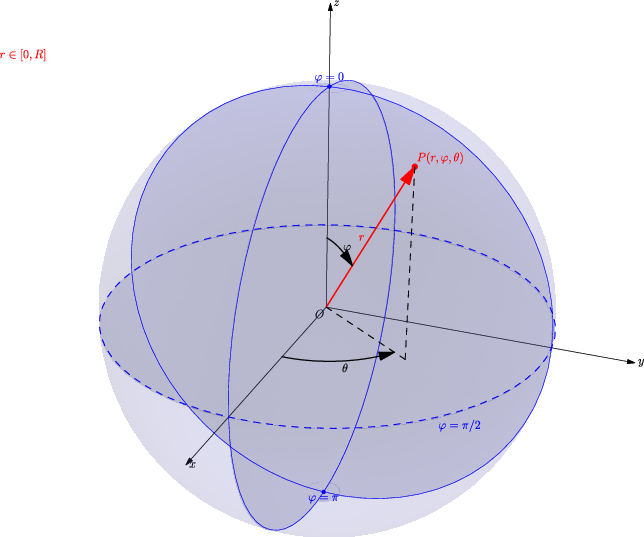
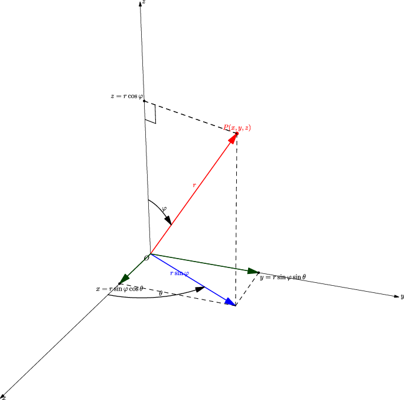

## 5. 柱面坐标与球面坐标：遇到对称体，换把尺子量

### 与上一小节关系

上一节用直角坐标算三重积分。但遇到圆柱、圆锥、球体、旋转抛物面时，直角坐标的边界会变成复杂的根号表达式。本节引入柱面坐标和球面坐标——利用对称性，把曲面边界变成**常数**。

### 学习目标

- 掌握柱面坐标和球面坐标的变换公式。
- 记住两个体积元素：$\rho\,d\rho\,d\theta\,dz$ 和 $r^2\sin\varphi\,dr\,d\varphi\,d\theta$。
- 会根据空间体的对称性选择正确坐标系。

---

### 5.1 柱面坐标：极坐标 + $z$ 轴不变

柱面坐标就是把 $xOy$ 平面换成极坐标，$z$ 保持不变：

$$
\boxed{
x = \rho\cos\theta,\quad y = \rho\sin\theta,\quad z = z
}
$$

体积元素：

$$
\boxed{dV = \rho\,d\rho\,d\theta\,dz}
$$

（就是极坐标面积元素 $\rho\,d\rho\,d\theta$ 再乘高度 $dz$。）

**适合什么题？**

| 信号 | 柱面坐标写法 |
|------|-------------|
| 圆柱面 $x^2+y^2=a^2$ | $\rho = a$ |
| 旋转抛物面 $z = x^2+y^2$ | $z = \rho^2$ |
| 圆锥面 $z = \sqrt{x^2+y^2}$ | $z = \rho$ |
| 被积函数含 $x^2+y^2$ | → $\rho^2$ |
| 空间体绕 $z$ 轴对称 | $\theta$ 范围独立 |


---

### 5.2 球面坐标：换一种"经纬度"定位

#### 5.2.0 地球仪类比——先建立直觉

球面坐标就像在地球仪上定位一个城市：

- **$r$** = 离地心的深度（地球半径 + 海拔）
- **$\varphi$** = 从北极往下量的角度（$\varphi=0$ 是北极，$\varphi=\pi/2$ 是赤道，$\varphi=\pi$ 是南极）
- **$\theta$** = 经度（在赤道面上转）

> ⚠️ **关键区别**：$\varphi$ 是从**正 $z$ 轴（北极）往下量**的，不是从赤道面往上量的仰角。$\varphi=0$ 对应北极，$\varphi=\pi/2$ 对应赤道，$\varphi=\pi$ 对应南极。



---

#### 5.2.1 三个变量精确定义

| 变量 | 含义 | 范围 | 类比 |
|------|------|------|------|
| $r$ | 点到原点的**直线距离** | $0 \le r < \infty$ | 地心到你的距离 |
| $\varphi$ | 连线与**正 $z$ 轴**的夹角 | $0 \le \varphi \le \pi$ | 从北极量下来的纬度角 |
| $\theta$ | 连线在 $xy$ 平面的投影与**正 $x$ 轴**的夹角 | $0 \le \theta \le 2\pi$ | 经度（和极坐标的 $\theta$ 一样） |

---

#### 5.2.2 变换公式是怎么来的？

目标是：已知 $(r, \varphi, \theta)$，求 $(x, y, z)$。



**第一步：定 $z$**

从原点出发，沿 $z$ 轴方向的分量：

$$
z = r\cos\varphi
$$

（$\varphi=0$ 时 $z=r$，在北极；$\varphi=\pi/2$ 时 $z=0$，在赤道；$\varphi=\pi$ 时 $z=-r$，在南极。）

**第二步：定水平距离**

$P$ 点到 $z$ 轴的水平距离（在 $xy$ 平面上的投影半径）：

$$
\text{水平距离} = r\sin\varphi
$$

（$\varphi=0$ 时水平距离 $=0$，北极正上方，投影缩成一个点；$\varphi=\pi/2$ 时水平距离 $=r$，赤道上投影距离最大。）

**第三步：在水平面内分解为 $x$ 和 $y$**

把水平距离 $r\sin\varphi$ 当成极坐标的「$\rho$」，加上角度 $\theta$：

$$
\begin{aligned}
x &= (r\sin\varphi) \cdot \cos\theta \\
y &= (r\sin\varphi) \cdot \sin\theta
\end{aligned}
$$

合在一起就是：

$$
\boxed{
\begin{aligned}
x &= r\sin\varphi\cos\theta \\
y &= r\sin\varphi\sin\theta \\
z &= r\cos\varphi
\end{aligned}
}
$$

---

#### 5.2.3 体积元素：$r^2\sin\varphi$ 怎么来的？

球面坐标下切出的小块是一个「曲边六面体」，有三条棱：


**棱 1（径向，沿 $r$）**：直接就是 $dr$。走一步就是一步。

**棱 2（经线方向，沿 $\varphi$）**：这是一段**大圆弧**。半径是 $r$，角度变化 $d\varphi$，弧长 = 半径 × 角度：

$$
\text{棱长} = r \cdot d\varphi
$$

**棱 3（纬线方向，沿 $\theta$）**：这是一段**小圆弧**，但注意！纬线所在的圆的半径**不是 $r$**，而是该纬度处的水平截面半径 $r\sin\varphi$。

```
        北极 (φ=0)
         │
    ─────┼─────  ← 纬度 φ 处的纬线圈
         │        半径 = r·sinφ（比 r 小！）
         │
        赤道 (φ=π/2)
         │        半径 = r（最大）
         │
        南极 (φ=π)
```

在纬度 $\varphi$ 处转 $d\theta$，弧长 = 纬线半径 × 角度：

$$
\text{棱长} = (r\sin\varphi) \cdot d\theta
$$

**三条棱乘起来**：

$$
dV = \underbrace{dr}_{\text{径向}} \times \underbrace{r\,d\varphi}_{\text{经线}} \times \underbrace{r\sin\varphi\,d\theta}_{\text{纬线}}
= \boxed{r^2\sin\varphi\,dr\,d\varphi\,d\theta}
$$

---

#### 5.2.4 跟极坐标对比，一脉相承

二重极坐标你完全懂了：面积元素 $d\sigma = \rho\,d\rho\,d\theta$，那个 $\rho$ 是因为「弧长 $= \rho\,d\theta$」。

球面坐标就是把这个思路再推一维：

| | 二重极坐标 | 三重球面坐标 |
|------|------|------|
| 径向变量 | $\rho$ | $r$ |
| 角度变量 | $\theta$（1 个） | $\varphi$（经线）+ $\theta$（纬线） |
| 棱 1 | 径向：$d\rho$ | 径向：$dr$ |
| 棱 2 | 弧长：$\rho\,d\theta$ | 经线弧长：$r\,d\varphi$ |
| 棱 3 | — | 纬线弧长：$r\sin\varphi\,d\theta$ |
| 元素 | $\rho\,d\rho\,d\theta$ | $r\,dr \cdot r\sin\varphi\,d\varphi\,d\theta = r^2\sin\varphi\,dr\,d\varphi\,d\theta$ |

核心逻辑没变——都是「弧长 = 半径 × 角度」，只不过球面坐标里纬线半径不是 $r$，而是 $r\sin\varphi$。

---

#### 5.2.5 计算流程

和极坐标一模一样，多了一维而已：

| 步骤 | 做什么 |
|------|--------|
| 1 | $x^2+y^2+z^2 \to r^2$，$z \to r\cos\varphi$，$\sqrt{x^2+y^2} \to r\sin\varphi$ |
| 2 | 确定 $\theta$ 范围（扫过多大角度） |
| 3 | 确定 $\varphi$ 范围（从北极量到南极，扫过多大） |
| 4 | 确定 $r$ 范围（从哪个面进，到哪个面出） |
| 5 | 体积元素：$r^2\sin\varphi\,dr\,d\varphi\,d\theta$ |

积分写成：

$$
\iiint_\Omega f\,dV
= \int_{\theta_1}^{\theta_2} \int_{\varphi_1}^{\varphi_2} \int_{r_1(\varphi,\theta)}^{r_2(\varphi,\theta)}
f \cdot r^2\sin\varphi \, dr\,d\varphi\,d\theta
$$

> 习惯上积分次序：$dr$ 最内层，$d\varphi$ 中间，$d\theta$ 最外层。因为 $r$ 的范围常依赖 $\varphi$ 和 $\theta$，$\varphi$ 的范围可能依赖 $\theta$。

**适合什么题？**

| 信号 | 球面坐标写法 |
|------|-------------|
| 球面 $x^2+y^2+z^2=a^2$ | $r = a$ |
| 圆锥面（顶点在原点） | $\varphi = \text{常数}$ |
| 被积函数含 $x^2+y^2+z^2$ | → $r^2$ |
| 球心在原点的球体 | 三组积分限全是常数 |

---

### 5.3 选坐标系的决策树

```
空间体长什么样？
├── 绕 z 轴对称（圆柱、抛物面、锥面）
│   └── 用柱面坐标
├── 关于原点球对称（球、球冠、球扇）
│   └── 用球面坐标
├── 以上都不是，但边界是平面
│   └── 用直角坐标
└── 不确定
    └── 画图，看哪个坐标系下边界最简单
```

---

### 5.4 操作流程

**柱面坐标**：

1. $x^2+y^2 \to \rho^2$，$x \to \rho\cos\theta$，$y \to \rho\sin\theta$
2. 确定 $\theta$ 范围（扫过多大角度）
3. 确定 $\rho$ 范围（从哪条曲面进、到哪条曲面出）
4. 确定 $z$ 范围（下表面到上表面）
5. 体积元素：$\rho\,d\rho\,d\theta\,dz$

**球面坐标**：

1. $x^2+y^2+z^2 \to r^2$，$z \to r\cos\varphi$，$\sqrt{x^2+y^2} \to r\sin\varphi$
2. 确定 $\theta$ 范围
3. 确定 $\varphi$ 范围（从 $z$ 轴正向量起！）
4. 确定 $r$ 范围
5. 体积元素：$r^2\sin\varphi\,dr\,d\varphi\,d\theta$

---

### 5.5 例题

**例 1（柱面坐标）**：计算

$$
\iiint_\Omega z\,dx\,dy\,dz,
$$

其中 $\Omega$ 由 $z = x^2 + y^2$ 和 $z = 4$ 围成。

柱面坐标下：$z = \rho^2$（下表面），$z = 4$（上表面）。两曲面交于 $\rho = 2$。

$$
0 \le \theta \le 2\pi,\quad 0 \le \rho \le 2,\quad \rho^2 \le z \le 4.
$$

$$
\begin{aligned}
\iiint_\Omega z\,dV
&= \int_0^{2\pi} \int_0^2 \int_{\rho^2}^4 z \cdot \rho\,dz\,d\rho\,d\theta \
&= \int_0^{2\pi} \int_0^2 \frac{16 - \rho^4}{2}\,\rho\,d\rho\,d\theta \
&= \boxed{\frac{64\pi}{3}}.
\end{aligned}
$$

---

**例 2（球面坐标）**：求球面 $r = 2a\cos\varphi$ 与半顶角为 $\alpha$ 的锥面 $\varphi = \alpha$ 所围立体的体积。


球面 $r = 2a\cos\varphi$ 是球心在 $(0,0,a)$、半径为 $a$ 且过原点的球面。

$$
0 \le \theta \le 2\pi,\quad 0 \le \varphi \le \alpha,\quad 0 \le r \le 2a\cos\varphi.
$$

$$
\begin{aligned}
V &= \int_0^{2\pi} \int_0^\alpha \int_0^{2a\cos\varphi}
r^2\sin\varphi\,dr\,d\varphi\,d\theta \
&= \frac{16\pi a^3}{3} \int_0^\alpha \cos^3\varphi \sin\varphi\,d\varphi \
&= \boxed{\frac{4\pi a^3}{3}\left(1 - \cos^4\alpha\right)}.
\end{aligned}
$$

---

### 5.6 易错点

1. **体积元素因子是最常见的扣分点**：
   - 柱面坐标漏乘 $\rho$ → 全错
   - 球面坐标漏乘 $r^2\sin\varphi$ → 全错
2. **$\varphi$ 是从 $z$ 轴正向量起的角**（$0 \le \varphi \le \pi$），不是从 $xOy$ 平面量的仰角。别和物理里的球坐标搞混。
3. **球心不在原点的球面**不一定能写成 $r = \text{常数}$。比如球心在 $(0,0,a)$、过原点的球面是 $r = 2a\cos\varphi$。
4. **坐标范围要考虑空间体方位。** 上半球（$z \ge 0$）对应 $0 \le \varphi \le \pi/2$；第一卦限对应 $0 \le \theta \le \pi/2$ 且 $0 \le \varphi \le \pi/2$。

---

### 5.7 证明思路

柱面坐标体积元素 = 极坐标面积元素 × $dz$，直觉充分。

球面坐标体积元素：小曲边六面体的三条棱分别近似为 $dr$（径向）、$r\,d\varphi$（经线方向弧长）、$r\sin\varphi\,d\theta$（纬线方向弧长，因为该纬度处的"水平圆"半径是 $r\sin\varphi$）。三者乘积得 $r^2\sin\varphi\,dr\,d\varphi\,d\theta$。这个几何直觉足以支撑做题。

---
