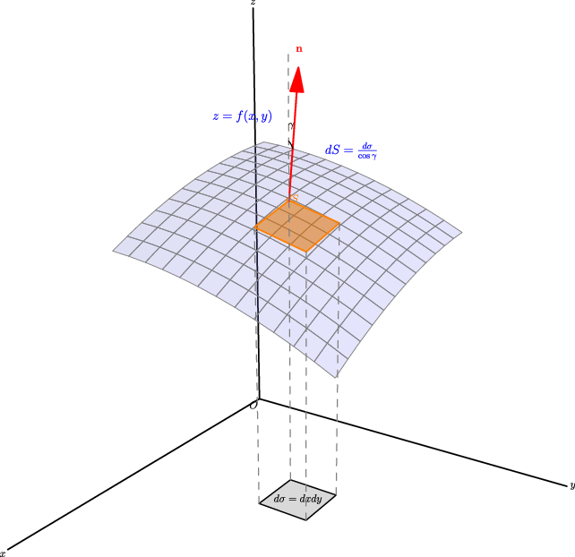
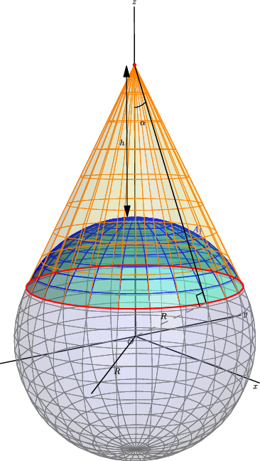

## 6. 重积分的应用：从体积到质量、质心、转动惯量、引力

### 与上一小节关系

前面五节都在学"怎么算"重积分。这一节回答"算什么"——把重积分用到几何和物理问题上。核心方法只有一个：**元素法**——先写小块贡献，再积分。

### 学习目标

- 会用二重积分求曲面面积。
- 会用重积分算质量、静矩、质心。
- 会算平面薄片和空间物体的转动惯量。
- 了解引力问题的积分写法。

---

### 6.1 元素法：贯穿全部应用题的"统一心法"

所有应用题的操作逻辑都一样：

> 1. 取一小块（面积元素 $d\sigma$ 或体积元素 $dV$）
> 2. 写出这小块的贡献（质量、静矩、转动惯量……）
> 3. 在整个区域上积分

不需要每个公式死记——理解了小块贡献的写法，公式自己就出来了。

---

### 6.2 曲面面积

曲面 $z = f(x,y)$ 在投影区域 $D$ 上的表面积：

$$
\boxed{
A = \iint_D \sqrt{1 + f_x^2 + f_y^2}\,dx\,dy
}
$$

**直觉**：曲面上一小片的实际面积 = 它的水平投影面积 × 放大因子 $\sqrt{1 + f_x^2 + f_y^2}$。曲面越陡（$f_x, f_y$ 越大），放大越多。

**例 1**：求半径为 $a$ 的球的表面积。

上半球面：$z = \sqrt{a^2 - x^2 - y^2}$。

$f_x = \frac{-x}{\sqrt{a^2-x^2-y^2}},\ f_y = \frac{-y}{\sqrt{a^2-x^2-y^2}}$。

$$
\sqrt{1 + f_x^2 + f_y^2} = \frac{a}{\sqrt{a^2 - x^2 - y^2}}.
$$

边界处（$x^2+y^2=a^2$）导数无界，先取 $D_b: x^2+y^2 \le b^2\ (b < a)$，最后令 $b \to a$。

极坐标下：

$$
A_b = \int_0^{2\pi} \int_0^b \frac{a}{\sqrt{a^2-\rho^2}}\,\rho\,d\rho\,d\theta
= 2\pi a\left(a - \sqrt{a^2-b^2}\right).
$$

令 $b \to a$，得上半球面积 $2\pi a^2$。整个球面积：

$$
\boxed{A = 4\pi a^2}.
$$

---

**例 2（经典应用题）**：地球同步卫星能覆盖多大比例的地球表面？

设地球半径 $R$，卫星距地面高度 $h$。覆盖区域是球面上的球冠，半顶角 $\alpha$ 满足 $\cos\alpha = \frac{R}{R+h}$。

球冠面积：$A = 2\pi R^2(1 - \cos\alpha)$。

与地球总面积 $4\pi R^2$ 的比值：

$$
\frac{A}{4\pi R^2} = \frac{1 - \cos\alpha}{2} = \frac{h}{2(R+h)}.
$$

代入 $R = 6400\text{ km},\ h = 36000\text{ km}$：

$$
\boxed{\frac{h}{2(R+h)} \approx 42.5\%}.
$$

---

### 6.3 质心（重心）

**平面薄片**（区域 $D$，面密度 $\mu(x,y)$）：

质量：$M = \iint_D \mu(x,y)\,d\sigma.$

对 $y$ 轴的静矩：$M_y = \iint_D x\mu(x,y)\,d\sigma.$

对 $x$ 轴的静矩：$M_x = \iint_D y\mu(x,y)\,d\sigma.$

质心：

$$
\boxed{
\bar x = \frac{M_y}{M} = \frac{\iint_D x\mu\,d\sigma}{\iint_D \mu\,d\sigma},\qquad
\bar y = \frac{M_x}{M} = \frac{\iint_D y\mu\,d\sigma}{\iint_D \mu\,d\sigma}
}
$$

**空间物体**（区域 $\Omega$，体密度 $\rho(x,y,z)$）：

$$
\boxed{
\bar x = \frac{1}{M}\iiint_\Omega x\rho\,dV,\quad
\bar y = \frac{1}{M}\iiint_\Omega y\rho\,dV,\quad
\bar z = \frac{1}{M}\iiint_\Omega z\rho\,dV
}
$$

其中 $M = \iiint_\Omega \rho\,dV$。

**记忆技巧**：$\bar x$ 的分子用 $x$ 乘密度再积分（这就是"对 $yz$ 平面的静矩"），分母是总质量。均匀物体密度可约去，此时分子就是坐标的积分，分母就是面积/体积。

---

**例 3**：求位于两圆 $\rho = 2\sin\theta$、$\rho = 4\sin\theta$ 之间的**均匀**薄片的质心。

区域关于 $y$ 轴对称 → $\bar x = 0$。

两圆都在上半平面（$0 \le \theta \le \pi$），面积 = 大圆面积 - 小圆面积 = $4\pi - \pi = 3\pi$。

极坐标下 $y = \rho\sin\theta$：

$$
\begin{aligned}
\iint_D y\,d\sigma
&= \int_0^\pi \int_{2\sin\theta}^{4\sin\theta}
(\rho\sin\theta)\,\rho\,d\rho\,d\theta \
&= \frac{56}{3} \int_0^\pi \sin^4\theta\,d\theta \
&= 7\pi.
\end{aligned}
$$

$$
\bar y = \frac{7\pi}{3\pi} = \frac{7}{3}.
$$

质心：$\boxed{\left(0,\ \dfrac{7}{3}\right)}$。

---

**例 4**：均匀半球体 $x^2+y^2+z^2 \le a^2,\ z \ge 0$ 的质心。

对称性 → $\bar x = \bar y = 0$。体积 $V = \frac{2\pi a^3}{3}$。

球面坐标下 $z = r\cos\varphi$：

$$
\iiint_\Omega z\,dV
= \int_0^{2\pi} \int_0^{\pi/2} \int_0^a
(r\cos\varphi)\,r^2\sin\varphi\,dr\,d\varphi\,d\theta
= \frac{\pi a^4}{4}.
$$

$$
\bar z = \frac{\pi a^4 / 4}{2\pi a^3 / 3} = \boxed{\frac{3a}{8}}.
$$

---

### 6.4 转动惯量

**平面薄片**对 $x$ 轴、$y$ 轴（其实是绕 $x$ 轴、$y$ 轴旋转）的转动惯量：

$$
\boxed{
I_x = \iint_D y^2\mu(x,y)\,d\sigma,\qquad
I_y = \iint_D x^2\mu(x,y)\,d\sigma
}
$$

**空间物体**对三个坐标轴的转动惯量：

$$
\boxed{
\begin{aligned}
I_x &= \iiint_\Omega (y^2+z^2)\rho\,dV \
I_y &= \iiint_\Omega (z^2+x^2)\rho\,dV \
I_z &= \iiint_\Omega (x^2+y^2)\rho\,dV
\end{aligned}
}
$$

**记忆口诀**：对哪个轴，就用**到该轴距离的平方**乘密度再积分。到 $x$ 轴的距离平方 = $y^2+z^2$（不含 $x$）。

---

**例 5**：半径为 $a$ 的均匀半圆薄片（面密度 $\mu$），求它对直径边的转动惯量。

取直径为 $x$ 轴，区域 $D: x^2+y^2 \le a^2,\ y \ge 0$。

$$
I_x = \iint_D y^2\mu\,d\sigma.
$$

极坐标：$0 \le \rho \le a,\ 0 \le \theta \le \pi$，$y = \rho\sin\theta$。

$$
\begin{aligned}
I_x
&= \mu \int_0^\pi \int_0^a \rho^2\sin^2\theta \cdot \rho\,d\rho\,d\theta \
&= \mu \cdot \frac{a^4}{4} \cdot \frac{\pi}{2} \
&= \frac{\pi\mu a^4}{8}.
\end{aligned}
$$

质量 $M = \frac12\pi a^2\mu$，所以 $I_x = \boxed{\dfrac{1}{4}Ma^2}$。

---

**例 6**：半径为 $a$ 的均匀球（密度 $\rho_0$），求它对过球心的一条轴的转动惯量。

取该轴为 $z$ 轴：

$$
I_z = \iiint_\Omega (x^2+y^2)\rho_0\,dV.
$$

球面坐标下 $x^2+y^2 = r^2\sin^2\varphi$：

$$
\begin{aligned}
I_z
&= \rho_0 \int_0^{2\pi} \int_0^\pi \int_0^a
r^2\sin^2\varphi \cdot r^2\sin\varphi\,dr\,d\varphi\,d\theta \
&= \frac{8\pi\rho_0 a^5}{15}.
\end{aligned}
$$

球的质量 $M = \frac{4\pi a^3\rho_0}{3}$，所以：

$$
\boxed{I_z = \frac{2}{5}Ma^2}.
$$

这个结果考试经常直接引用——**均匀球绕直径的转动惯量 = $\frac{2}{5}MR^2$**。

---

### 6.5 引力

空间物体 $\Omega$（密度 $\rho$）对外点 $P_0(x_0,y_0,z_0)$ 处单位质量质点的引力：

$$
\boxed{
\vec F = G\iiint_\Omega \rho(x,y,z)\,
\frac{(x-x_0,\ y-y_0,\ z-z_0)}
{[(x-x_0)^2+(y-y_0)^2+(z-z_0)^2]^{3/2}}
\,dV
}
$$

**公式解读**：小体积块产生引力，大小为 $G \cdot \rho\,dV / r^2$，方向指向源点 $(x,y,z)$。分母的 $r^3$ 是因为分子里已经有了方向向量（其模为 $r$），合起来是 $1/r^2$。

---

**例 7**：半径为 $R$ 的均匀球对球外一点 $M_0(0,0,a)$（$a > R$）处单位质量质点的引力。

由对称性，$F_x = F_y = 0$。牛顿早已证明：**均匀球对外部质点的引力，等价于把全部质量集中在球心。** 所以：

$$
\vec F = \left(0,\ 0,\ -\frac{GM}{a^2}\right),
$$

其中 $M = \frac{4\pi R^3\rho}{3}$。负号表示引力指向原点（球心）。

---

### 6.6 应用题"速查表"

| 求什么 | 小块贡献 | 积分类型 |
|--------|----------|----------|
| 平面区域面积 | $1 \cdot d\sigma$ | 二重积分 |
| 空间体体积 | $1 \cdot dV$ | 三重积分 |
| 曲面面积 | $\sqrt{1+f_x^2+f_y^2}\,dx\,dy$ | 二重积分 |
| 质量 | 密度 × $d\sigma$ 或 $dV$ | 二重/三重 |
| 质心 $\bar x$ | $x$ × 密度 × $d\sigma$/$dV$，再÷总质量 | 二重/三重 |
| 转动惯量 $I_x$ | （到 $x$ 轴距离²）× 密度 × $d\sigma$/$dV$ | 二重/三重 |
| 引力分量 | $G\rho \cdot (\text{方向余弦}) / r^2 \cdot dV$ | 三重积分 |

---

### 6.7 易错点

1. **曲面面积 ≠ 投影面积。** 必须乘 $\sqrt{1+f_x^2+f_y^2}$，除非曲面是水平的。
2. **质心分母是总质量（或总面积/总体积），不能漏。**
3. **$\bar x$ 的分子用的是 $x$，对应的是对 $yz$ 平面的静矩。** 不要和 $\bar y$ 的分子搞混。
4. **转动惯量用到轴距离的平方，不是到原点距离的平方。** $I_x$ 用 $y^2+z^2$，没有 $x^2$。
5. **引力是向量。** 若只算大小要说明方向；若算分量要保留符号。

---

### 6.8 证明思路

所有应用公式的推导都遵循同一个模式：元素法。取 $d\sigma$ 或 $dV$ → 写局部贡献的近似表达式 → 在整个区域上积分。曲面积公式源自"曲面小片用切平面近似，切平面面积 = 投影面积 / |\cos\gamma|"，其中 $\cos\gamma = 1/\sqrt{1+f_x^2+f_y^2}$。

---
